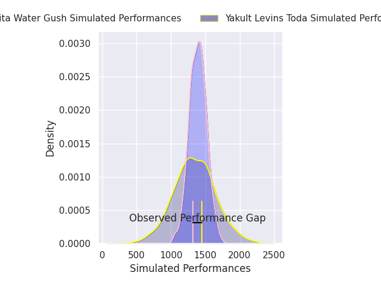
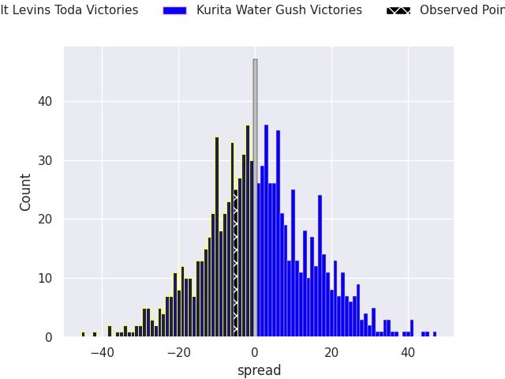
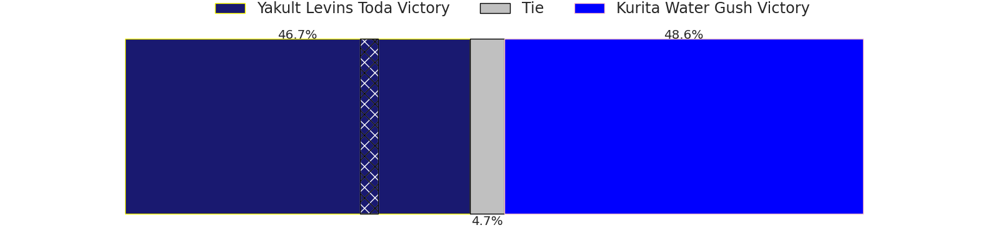
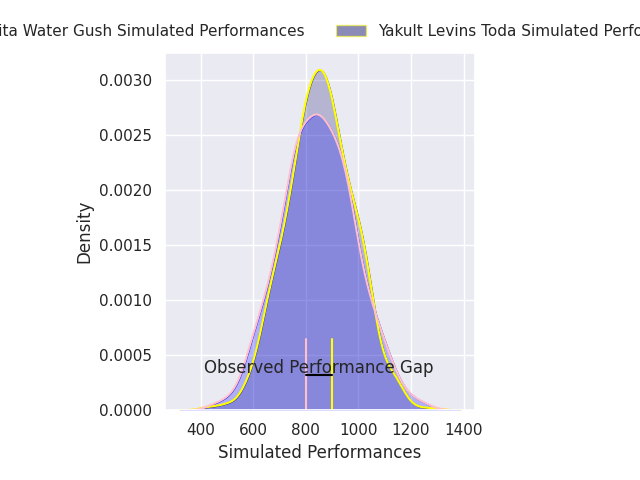
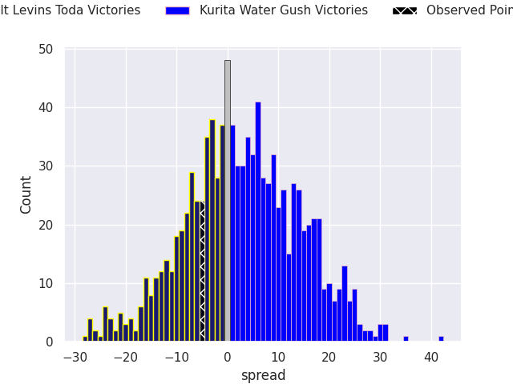
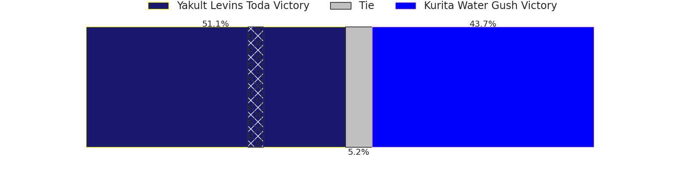

# Yakult Levins Toda V Kurita Water Gush on 2026/01/30, 25.0 to 20.0

# Club Level Predictions

Now that the game has been played, lets see how the club predictions did. I predicted Kurita Water Gush to win by 0.96, and Yakult Levins Toda won by 5.0. That's an absolute error of 6.0 for the margin of victory, while my average absolute error has been 13.3 over the past six months. This prediction was more accurate than 68.6% of my recent predictions.

For the Over/Under model, I predicted a total of 52.5 and we have an actual total of 45.0. That's an absolute error of 7.5 compared to a six month average of 12.5. This prediction was more accurate than 62.8% of my recent predictions.
## Projected Performances - Club Model

## Projected Spreads - Club Model

## Projected Results - Club Model

# Player Level Predictions

With the player model, I predicted Yakult Levins Toda to win by 0.59,  and Yakult Levins Toda won by 5.0. That's an absolute error of (np.float64(4.0), 1) for the margin of victory, while the average error as been 15.6 for the past six months. So this prediction was more accurate than 68.8% of my recent predictions.
## Projected Performances - Player Model

## Projected Spreads - Player Model

## Projected Results - Player Model

