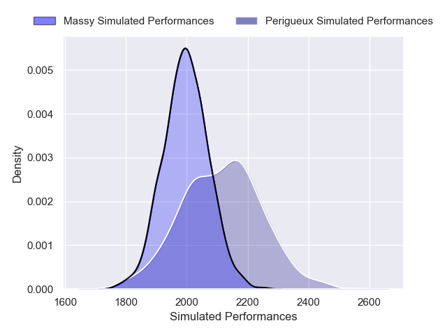
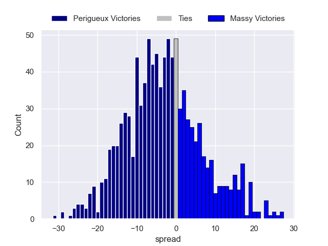
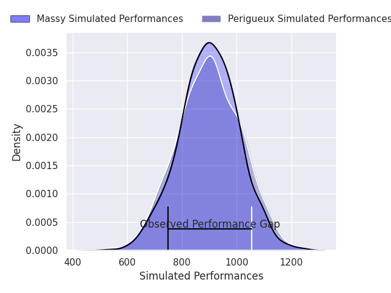
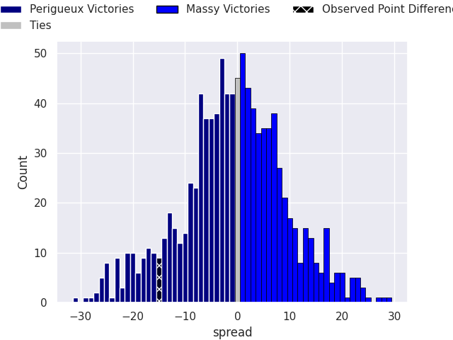

# Périgueux V Massy on 2026/01/31, 35.0 to 20.0

# Club Level Predictions

Now that the game has been played, lets see how the club predictions did. I predicted Perigueux to win by 3.2, and Perigueux won by 15.0. That's an absolute error of 11.8 for the margin of victory, while my average absolute error has been 13.3 over the past six months. This prediction was more accurate than 42.0% of my recent predictions.

For the Over/Under model, I predicted a total of 41.5 and we have an actual total of 55.0. That's an absolute error of 13.5 compared to a six month average of 12.5. This prediction was more accurate than 38.2% of my recent predictions.
## Projected Performances - Club Model

## Projected Spreads - Club Model

## Projected Results - Club Model

# Player Level Predictions

With the player model, I predicted Massy to win by 1.39,  and Perigueux won by 15.0. That's an absolute error of (np.float64(16.0), 1) for the margin of victory, while the average error as been 14.7 for the past six months. So this prediction was more accurate than 28.8% of my recent predictions.
## Projected Performances - Player Model

## Projected Spreads - Player Model

## Projected Results - Player Model

