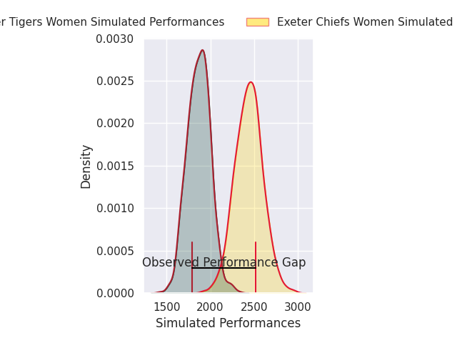
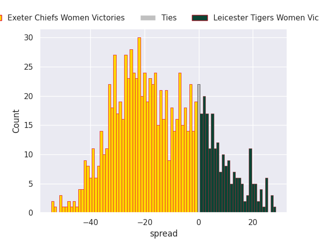
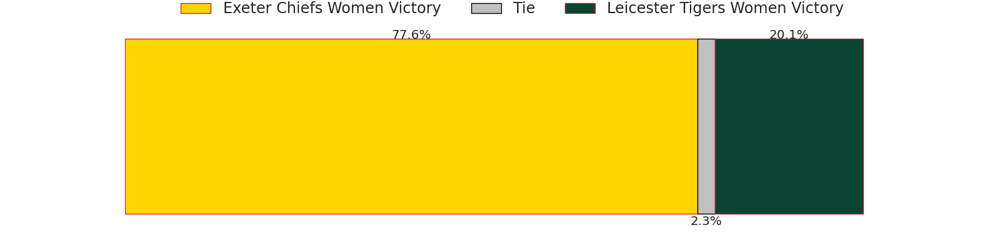

# Exeter Chiefs Women V Leicester Tigers Women on 2026/02/01, 36.0 to 0.0

# Club Level Predictions

Now that the game has been played, lets see how the club predictions did. I predicted Exeter Chiefs Women to win by 15.48, and Exeter Chiefs Women won by 36.0. That's an absolute error of 20.5 for the margin of victory, while my average absolute error has been 13.3 over the past six months. This prediction was more accurate than 22.0% of my recent predictions.

For the Over/Under model, I predicted a total of 41.5 and we have an actual total of 36.0. That's an absolute error of 5.5 compared to a six month average of 12.5. This prediction was more accurate than 73.0% of my recent predictions.
## Projected Performances - Club Model

## Projected Spreads - Club Model

## Projected Results - Club Model

