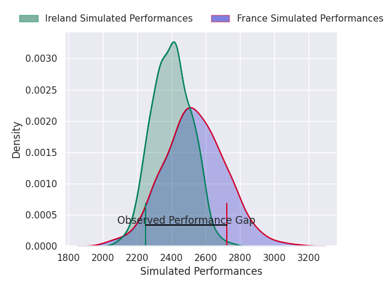
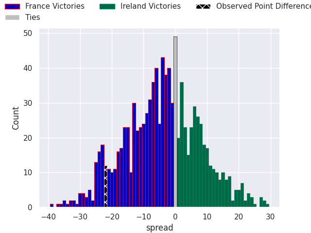
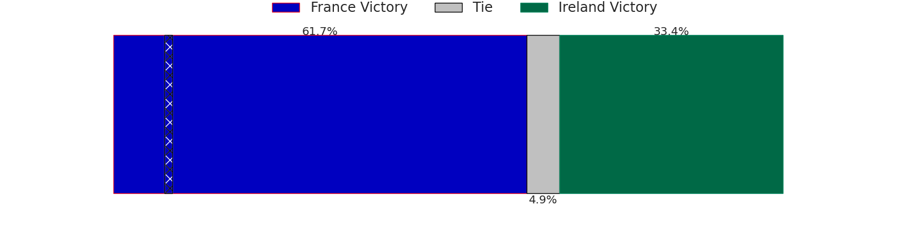
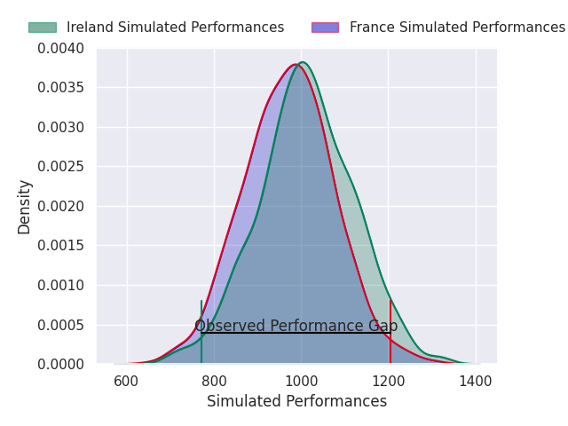
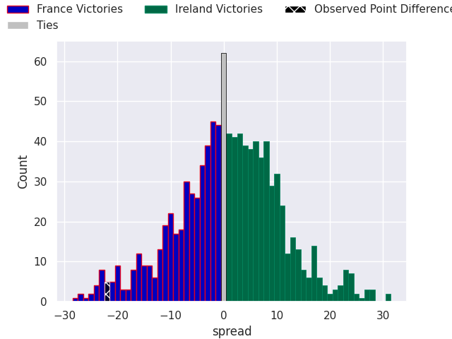

# France V Ireland on 2026/02/05, 36.0 to 14.0

# Club Level Predictions

Now that the game has been played, lets see how the club predictions did. I predicted France to win by 4.06, and France won by 22.0. That's an absolute error of 17.9 for the margin of victory, while my average absolute error has been 13.3 over the past six months. This prediction was more accurate than 26.8% of my recent predictions.

For the Over/Under model, I predicted a total of 47.5 and we have an actual total of 50.0. That's an absolute error of 2.5 compared to a six month average of 12.5. This prediction was more accurate than 87.6% of my recent predictions.
## Projected Performances - Club Model

## Projected Spreads - Club Model

## Projected Results - Club Model

# Player Level Predictions

With the player model, I predicted Ireland to win by 0.89,  and France won by 22.0. That's an absolute error of 22.9 for the margin of victory, while the average error as been 15.6 for the past six months. So this prediction was more accurate than 21.0% of my recent predictions.
## Projected Performances - Player Model

## Projected Spreads - Player Model

## Projected Results - Player Model

