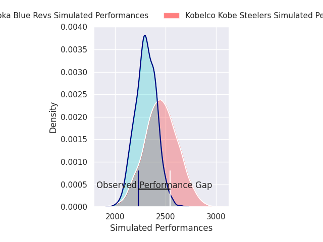
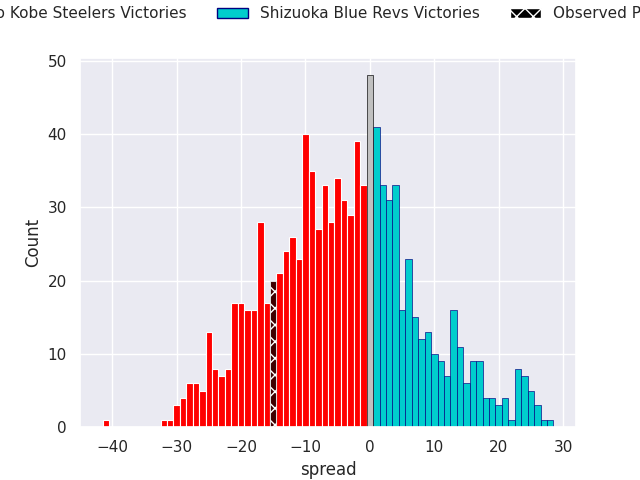
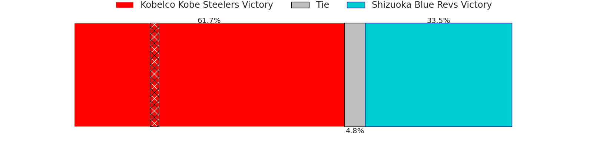

# Kobelco Kobe Steelers V Shizuoka Blue Revs on 2026/02/06, 60.0 to 45.0

# Club Level Predictions

Now that the game has been played, lets see how the club predictions did. I predicted Kobelco Kobe Steelers to win by 4.13, and Kobelco Kobe Steelers won by 15.0. That's an absolute error of 10.9 for the margin of victory, while my average absolute error has been 13.4 over the past six months. This prediction was more accurate than 45.5% of my recent predictions.

For the Over/Under model, I predicted a total of 55.5 and we have an actual total of 105.0. That's an absolute error of 49.5 compared to a six month average of 12.6. This prediction was more accurate than 0.3% of my recent predictions.
## Projected Performances - Club Model

## Projected Spreads - Club Model

## Projected Results - Club Model

