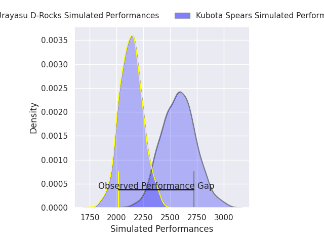
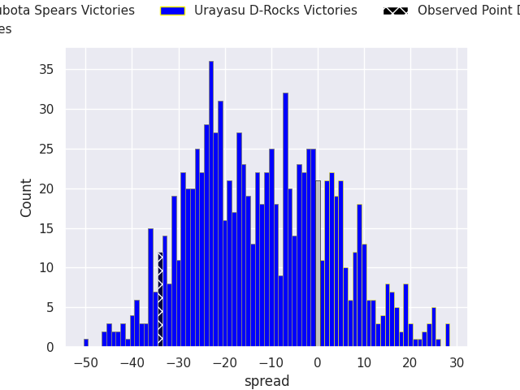
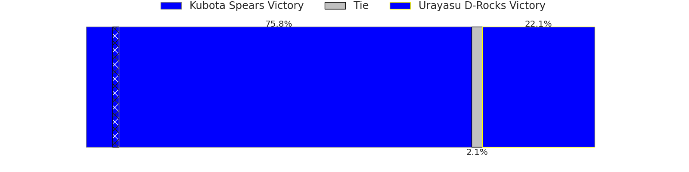
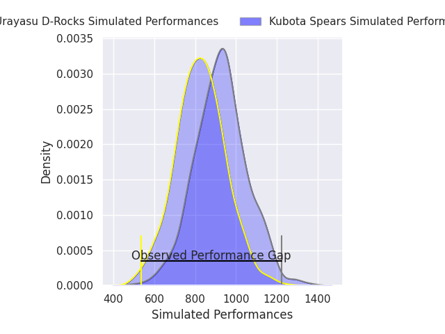
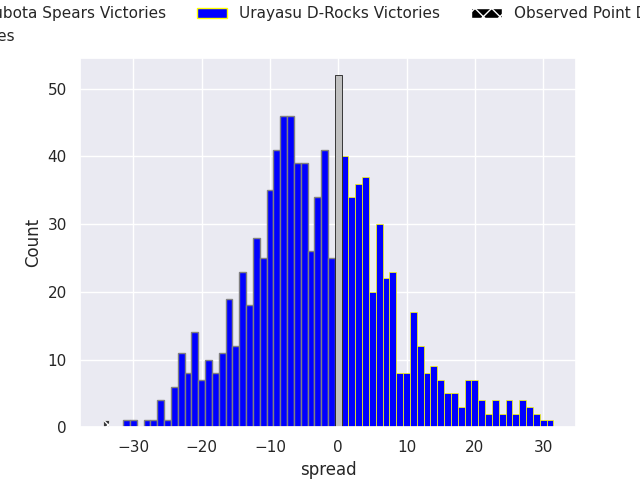
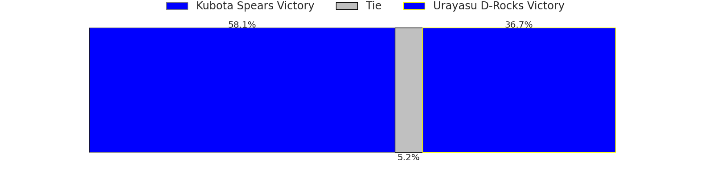

# Kubota Spears V Urayasu D-Rocks on 2026/02/06, 48.0 to 14.0

# Club Level Predictions

Now that the game has been played, lets see how the club predictions did. I predicted Kubota Spears to win by 11.96, and Kubota Spears won by 34.0. That's an absolute error of 22.0 for the margin of victory, while my average absolute error has been 13.3 over the past six months. This prediction was more accurate than 19.6% of my recent predictions.

For the Over/Under model, I predicted a total of 51.5 and we have an actual total of 62.0. That's an absolute error of 10.5 compared to a six month average of 12.5. This prediction was more accurate than 48.8% of my recent predictions.
## Projected Performances - Club Model

## Projected Spreads - Club Model

## Projected Results - Club Model

# Player Level Predictions

With the player model, I predicted Kubota Spears to win by 2.55,  and Kubota Spears won by 34.0. That's an absolute error of 31.4 for the margin of victory, while the average error as been 15.6 for the past six months. So this prediction was more accurate than 12.9% of my recent predictions.
## Projected Performances - Player Model

## Projected Spreads - Player Model

## Projected Results - Player Model

