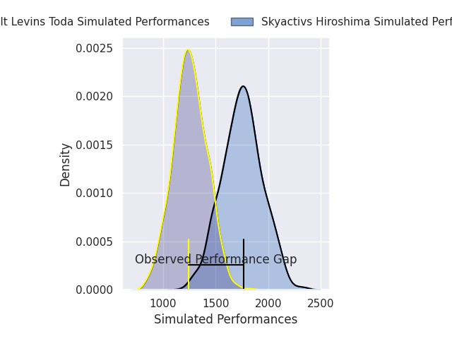
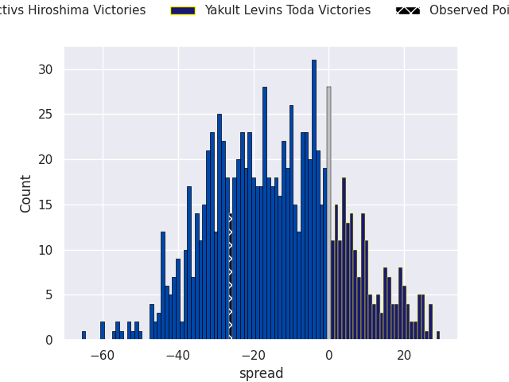
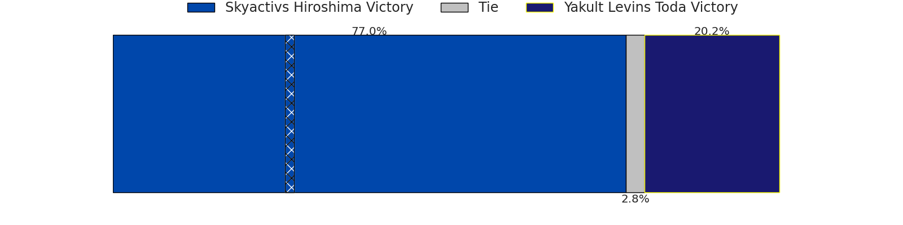
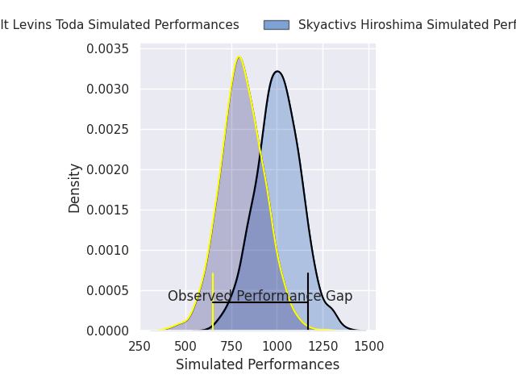
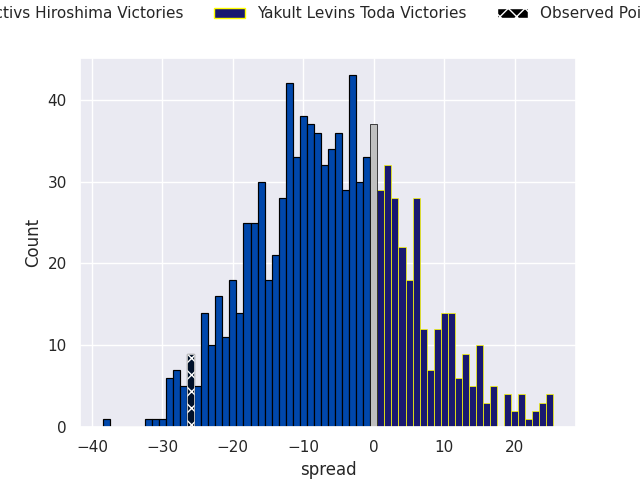

# Skyactivs Hiroshima V Yakult Levins Toda on 2026/02/06, 40.0 to 14.0

# Club Level Predictions

Now that the game has been played, lets see how the club predictions did. I predicted Skyactivs Hiroshima to win by 13.74, and Skyactivs Hiroshima won by 26.0. That's an absolute error of 12.3 for the margin of victory, while my average absolute error has been 13.4 over the past six months. This prediction was more accurate than 41.1% of my recent predictions.

For the Over/Under model, I predicted a total of 51.5 and we have an actual total of 54.0. That's an absolute error of 2.5 compared to a six month average of 12.6. This prediction was more accurate than 87.6% of my recent predictions.
## Projected Performances - Club Model

## Projected Spreads - Club Model

## Projected Results - Club Model

# Player Level Predictions

With the player model, I predicted Skyactivs Hiroshima to win by 5.82,  and Skyactivs Hiroshima won by 26.0. That's an absolute error of 20.2 for the margin of victory, while the average error as been 15.6 for the past six months. So this prediction was more accurate than 25.5% of my recent predictions.
## Projected Performances - Player Model

## Projected Spreads - Player Model

## Projected Results - Player Model

