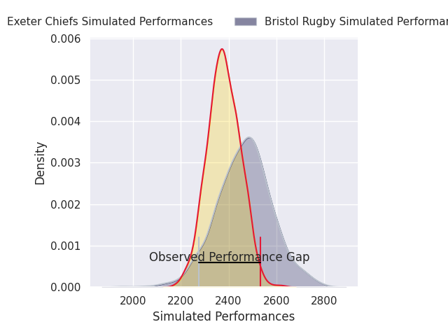
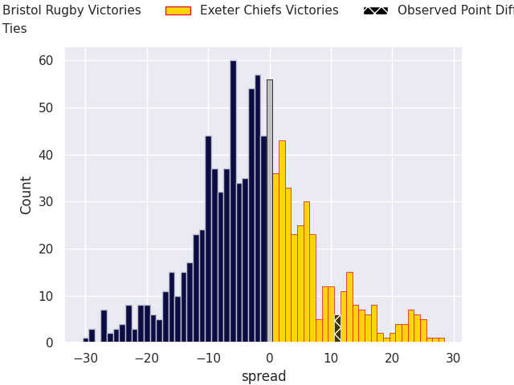
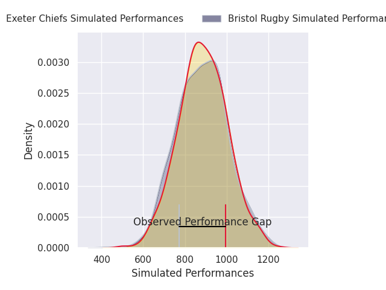
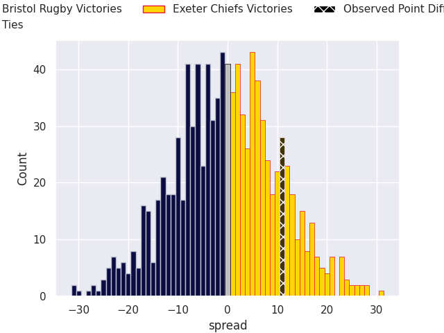

# Bristol Rugby V Exeter Chiefs on 2026/02/07, 35.0 to 46.0

# Club Level Predictions

Now that the game has been played, lets see how the club predictions did. I predicted Bristol Rugby to win by 2.47, and Exeter Chiefs won by 11.0. That's an absolute error of 13.5 for the margin of victory, while my average absolute error has been 13.4 over the past six months. This prediction was more accurate than 37.2% of my recent predictions.

For the Over/Under model, I predicted a total of 47.5 and we have an actual total of 81.0. That's an absolute error of 33.5 compared to a six month average of 12.6. This prediction was more accurate than 3.5% of my recent predictions.
## Projected Performances - Club Model

## Projected Spreads - Club Model

## Projected Results - Club Model

# Player Level Predictions

With the player model, I predicted Bristol Rugby to win by 0.34,  and Exeter Chiefs won by 11.0. That's an absolute error of 11.3 for the margin of victory, while the average error as been 15.6 for the past six months. So this prediction was more accurate than 45.2% of my recent predictions.
## Projected Performances - Player Model

## Projected Spreads - Player Model

## Projected Results - Player Model

