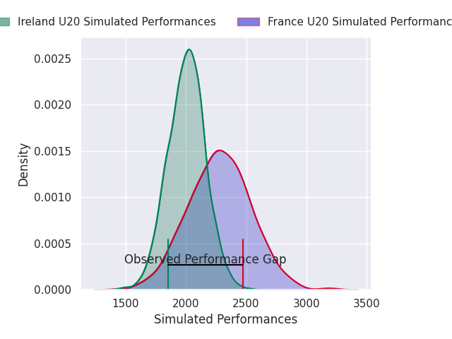
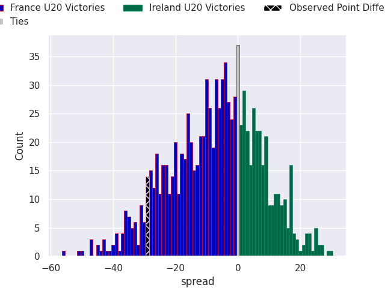
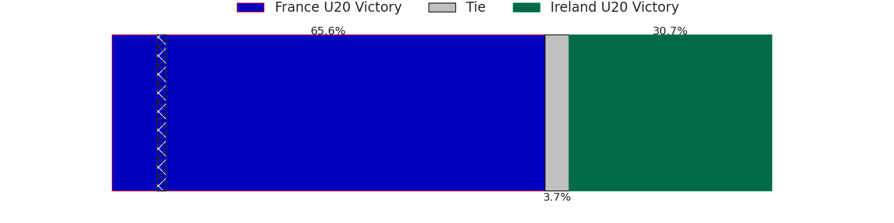

# France U20 V Ireland U20 on 2026/02/07, 50.0 to 21.0

# Club Level Predictions

Now that the game has been played, lets see how the club predictions did. I predicted France U20 to win by 7.29, and France U20 won by 29.0. That's an absolute error of 21.7 for the margin of victory, while my average absolute error has been 13.3 over the past six months. This prediction was more accurate than 20.0% of my recent predictions.

For the Over/Under model, I predicted a total of 50.5 and we have an actual total of 71.0. That's an absolute error of 20.5 compared to a six month average of 12.5. This prediction was more accurate than 18.6% of my recent predictions.
## Projected Performances - Club Model

## Projected Spreads - Club Model

## Projected Results - Club Model

