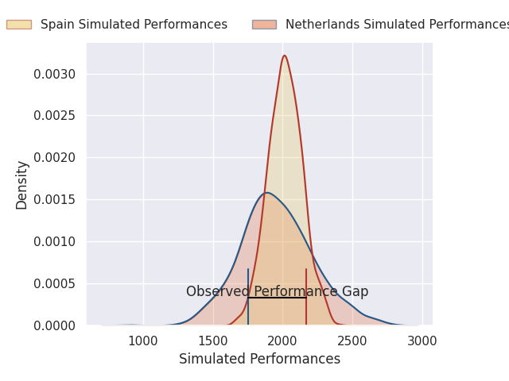
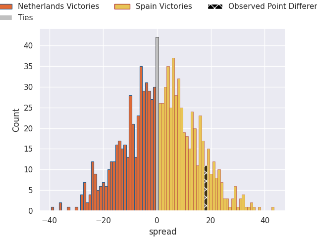

# Netherlands V Spain on 2026/02/07, 33.0 to 51.0

# Club Level Predictions

Now that the game has been played, lets see how the club predictions did. I predicted Spain to win by 1.17, and Spain won by 18.0. That's an absolute error of 16.8 for the margin of victory, while my average absolute error has been 13.4 over the past six months. This prediction was more accurate than 28.6% of my recent predictions.

For the Over/Under model, I predicted a total of 52.5 and we have an actual total of 84.0. That's an absolute error of 31.5 compared to a six month average of 12.6. This prediction was more accurate than 5.6% of my recent predictions.
## Projected Performances - Club Model

## Projected Spreads - Club Model

## Projected Results - Club Model

