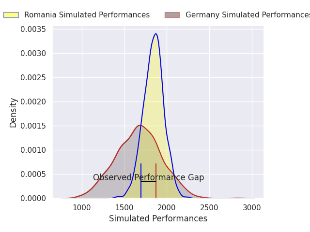
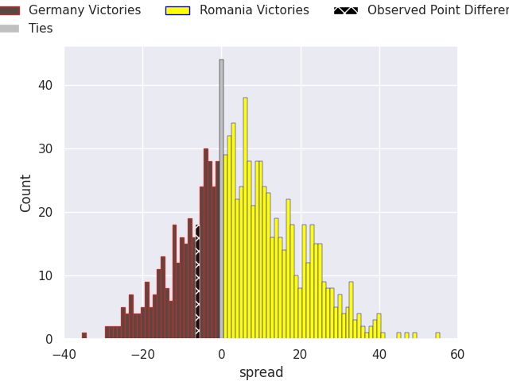
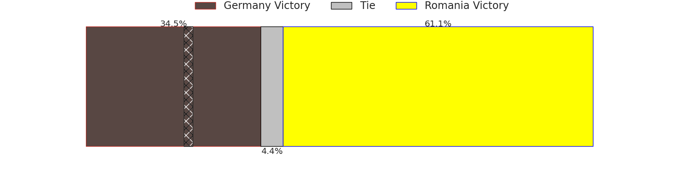

# Germany V Romania on 2026/02/08, 30.0 to 24.0

# Club Level Predictions

Now that the game has been played, lets see how the club predictions did. I predicted Romania to win by 5.13, and Germany won by 6.0. That's an absolute error of 11.1 for the margin of victory, while my average absolute error has been 13.4 over the past six months. This prediction was more accurate than 44.6% of my recent predictions.

For the Over/Under model, I predicted a total of 47.5 and we have an actual total of 54.0. That's an absolute error of 6.5 compared to a six month average of 12.6. This prediction was more accurate than 66.8% of my recent predictions.
## Projected Performances - Club Model

## Projected Spreads - Club Model

## Projected Results - Club Model

