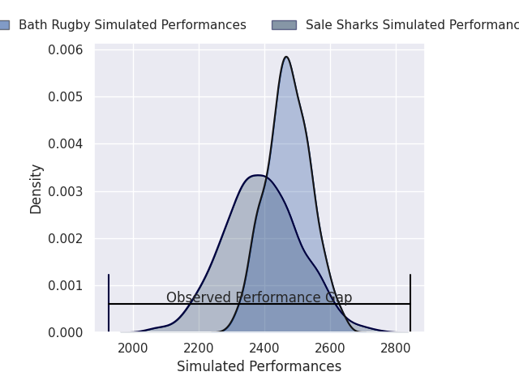
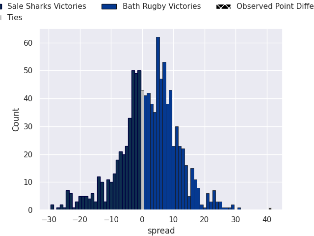

# Sale Sharks V Bath Rugby on 2026/02/08, 19.0 to 60.0

# Club Level Predictions

Now that the game has been played, lets see how the club predictions did. I predicted Bath Rugby to win by 2.08, and Bath Rugby won by 41.0. That's an absolute error of 38.9 for the margin of victory, while my average absolute error has been 13.3 over the past six months. This prediction was more accurate than 4.7% of my recent predictions.

For the Over/Under model, I predicted a total of 49.5 and we have an actual total of 79.0. That's an absolute error of 29.5 compared to a six month average of 12.5. This prediction was more accurate than 6.8% of my recent predictions.
## Projected Performances - Club Model

## Projected Spreads - Club Model

## Projected Results - Club Model

