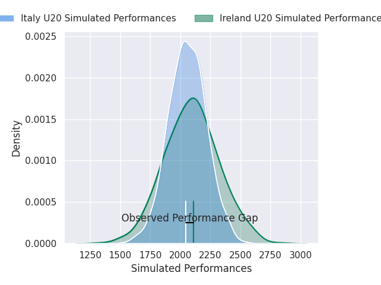
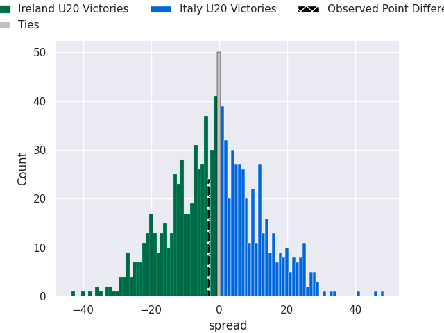

# Ireland U20 V Italy U20 on 2026/02/13, 30.0 to 27.0

# Club Level Predictions

Now that the game has been played, lets see how the club predictions did. I predicted Ireland U20 to win by 1.16, and Ireland U20 won by 3.0. That's an absolute error of 1.8 for the margin of victory, while my average absolute error has been 13.4 over the past six months. This prediction was more accurate than 90.1% of my recent predictions.

For the Over/Under model, I predicted a total of 46.5 and we have an actual total of 57.0. That's an absolute error of 10.5 compared to a six month average of 12.8. This prediction was more accurate than 50.1% of my recent predictions.
## Projected Performances - Club Model

## Projected Spreads - Club Model

## Projected Results - Club Model

