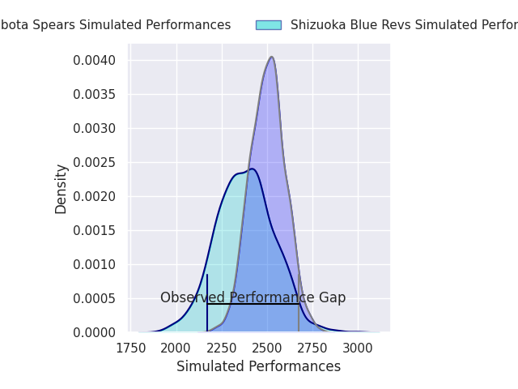
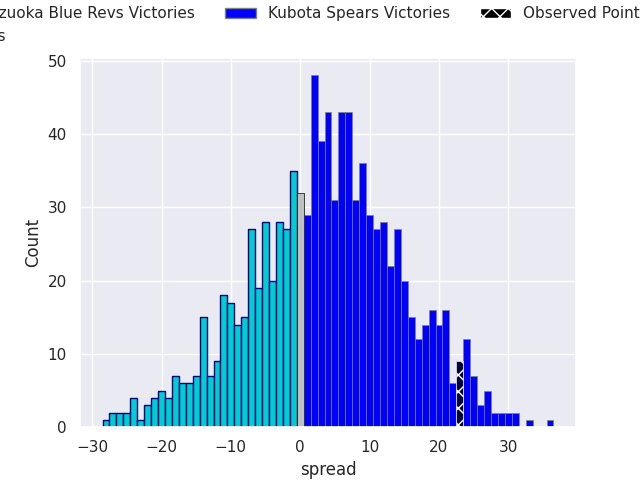
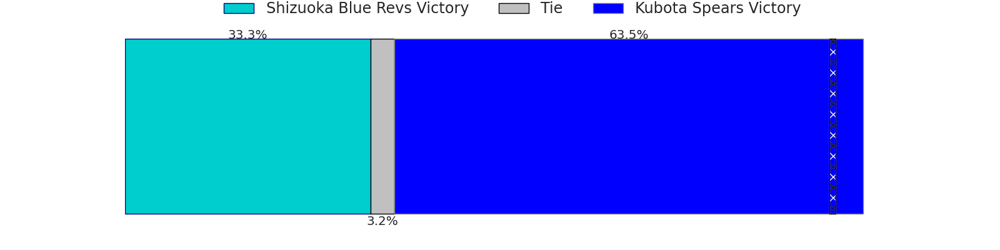
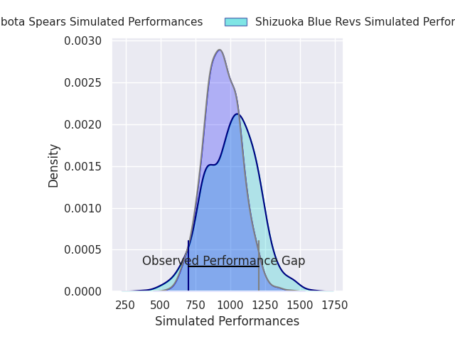
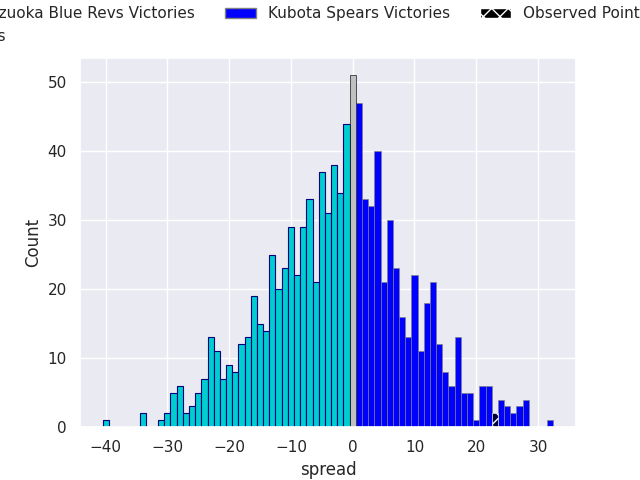
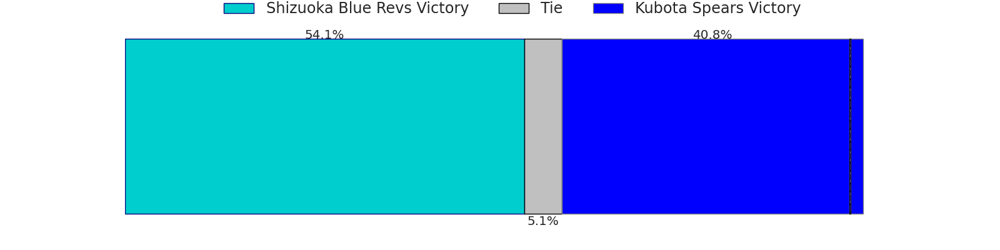

# Shizuoka Blue Revs V Kubota Spears on 2026/02/13, 19.0 to 42.0

# Club Level Predictions

Now that the game has been played, lets see how the club predictions did. I predicted Kubota Spears to win by 3.75, and Kubota Spears won by 23.0. That's an absolute error of 19.2 for the margin of victory, while my average absolute error has been 13.4 over the past six months. This prediction was more accurate than 24.1% of my recent predictions.

For the Over/Under model, I predicted a total of 49.5 and we have an actual total of 61.0. That's an absolute error of 11.5 compared to a six month average of 12.8. This prediction was more accurate than 46.7% of my recent predictions.
## Projected Performances - Club Model

## Projected Spreads - Club Model

## Projected Results - Club Model

# Player Level Predictions

With the player model, I predicted Shizuoka Blue Revs to win by 2.1,  and Kubota Spears won by 23.0. That's an absolute error of 25.1 for the margin of victory, while the average error as been 14.5 for the past six months. So this prediction was more accurate than 15.9% of my recent predictions.
## Projected Performances - Player Model

## Projected Spreads - Player Model

## Projected Results - Player Model

