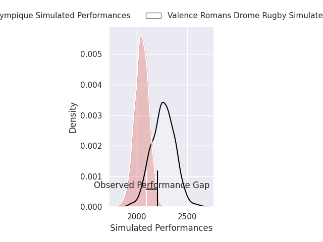
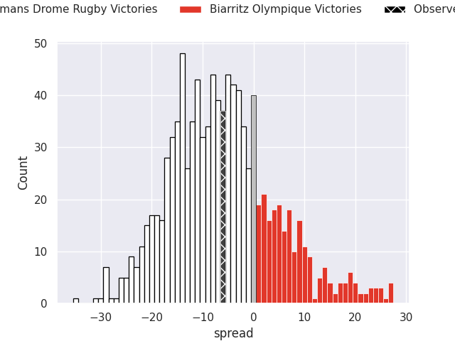
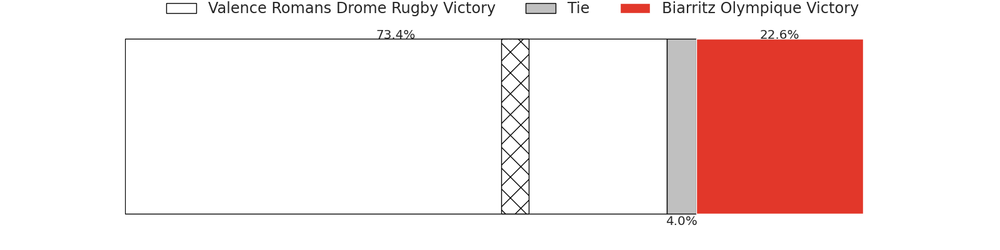
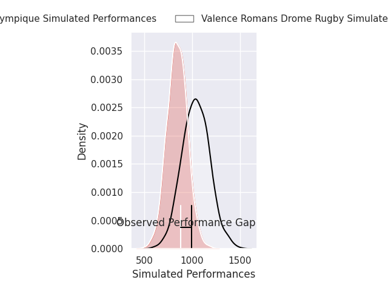
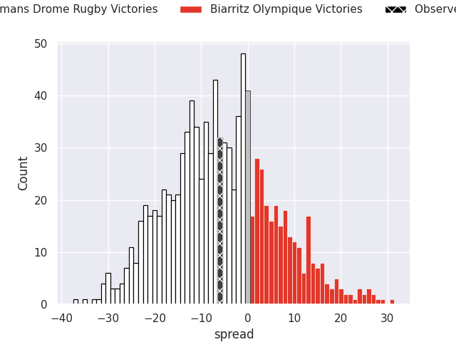
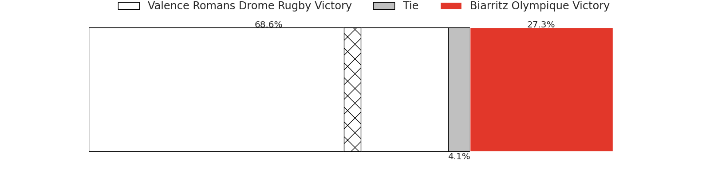

# Valence Romans Drome Rugby V Biarritz Olympique on 2026/02/13, 15.0 to 9.0

# Club Level Predictions

Now that the game has been played, lets see how the club predictions did. I predicted Valence Romans Drome Rugby to win by 6.03, and Valence Romans Drome Rugby won by 6.0. That's an absolute error of 0.0 for the margin of victory, while my average absolute error has been 13.4 over the past six months. This prediction was more accurate than 99.8% of my recent predictions.

For the Over/Under model, I predicted a total of 47.5 and we have an actual total of 24.0. That's an absolute error of 23.5 compared to a six month average of 12.8. This prediction was more accurate than 14.8% of my recent predictions.
## Projected Performances - Club Model

## Projected Spreads - Club Model

## Projected Results - Club Model

# Player Level Predictions

With the player model, I predicted Valence Romans Drome Rugby to win by 5.61,  and Valence Romans Drome Rugby won by 6.0. That's an absolute error of 0.4 for the margin of victory, while the average error as been 14.5 for the past six months. So this prediction was more accurate than 86.6% of my recent predictions.
## Projected Performances - Player Model

## Projected Spreads - Player Model

## Projected Results - Player Model

