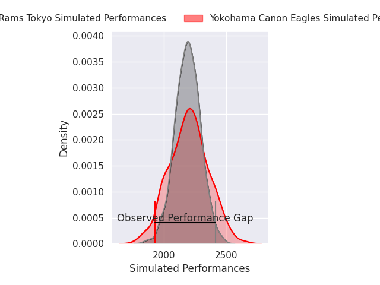
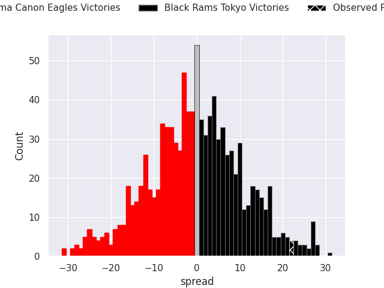
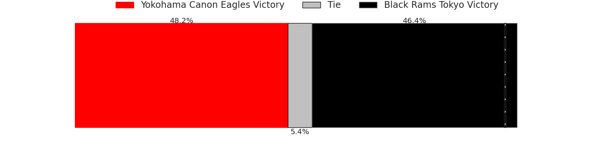
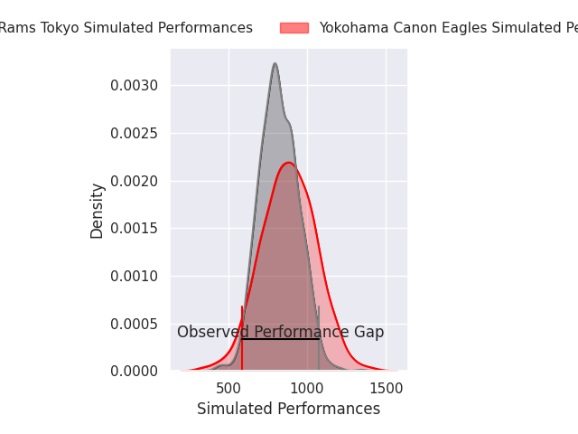
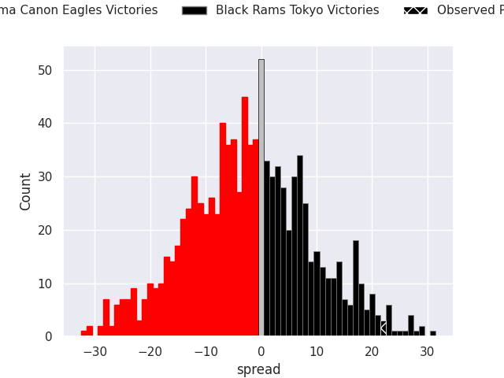
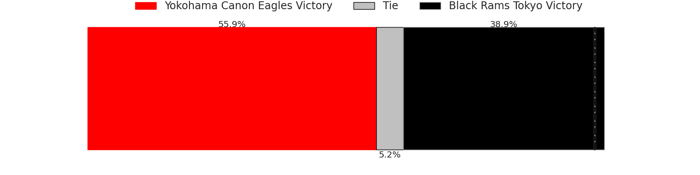

# Yokohama Canon Eagles V Black Rams Tokyo on 2026/02/13, 31.0 to 53.0

# Club Level Predictions

Now that the game has been played, lets see how the club predictions did. I predicted Yokohama Canon Eagles to win by 0.18, and Black Rams Tokyo won by 22.0. That's an absolute error of 22.2 for the margin of victory, while my average absolute error has been 13.4 over the past six months. This prediction was more accurate than 19.4% of my recent predictions.

For the Over/Under model, I predicted a total of 48.5 and we have an actual total of 84.0. That's an absolute error of 35.5 compared to a six month average of 12.8. This prediction was more accurate than 2.9% of my recent predictions.
## Projected Performances - Club Model

## Projected Spreads - Club Model

## Projected Results - Club Model

# Player Level Predictions

With the player model, I predicted Yokohama Canon Eagles to win by 2.09,  and Black Rams Tokyo won by 22.0. That's an absolute error of 24.1 for the margin of victory, while the average error as been 14.5 for the past six months. So this prediction was more accurate than 17.1% of my recent predictions.
## Projected Performances - Player Model

## Projected Spreads - Player Model

## Projected Results - Player Model

