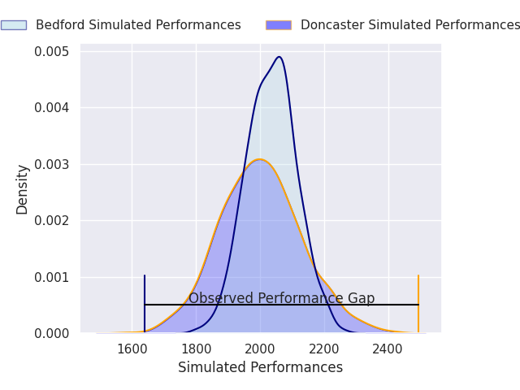
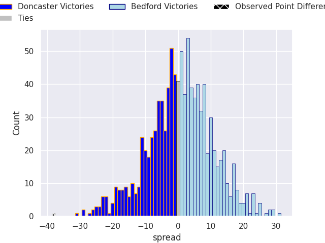
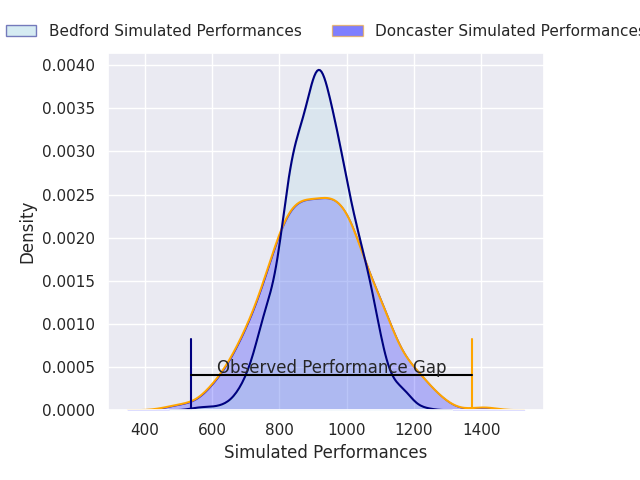
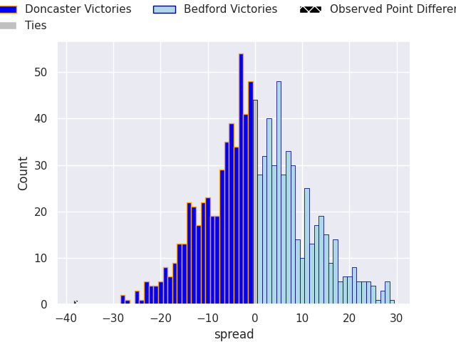

# Doncaster V Bedford on 2026/02/14, 50.0 to 12.0

# Club Level Predictions

Now that the game has been played, lets see how the club predictions did. I predicted Bedford to win by 0.76, and Doncaster won by 38.0. That's an absolute error of 38.8 for the margin of victory, while my average absolute error has been 13.4 over the past six months. This prediction was more accurate than 4.9% of my recent predictions.

For the Over/Under model, I predicted a total of 48.5 and we have an actual total of 62.0. That's an absolute error of 13.5 compared to a six month average of 12.8. This prediction was more accurate than 39.1% of my recent predictions.
## Projected Performances - Club Model

## Projected Spreads - Club Model

## Projected Results - Club Model

# Player Level Predictions

With the player model, I predicted Bedford to win by 0.17,  and Doncaster won by 38.0. That's an absolute error of 38.2 for the margin of victory, while the average error as been 14.5 for the past six months. So this prediction was more accurate than 6.6% of my recent predictions.
## Projected Performances - Player Model

## Projected Spreads - Player Model

## Projected Results - Player Model

