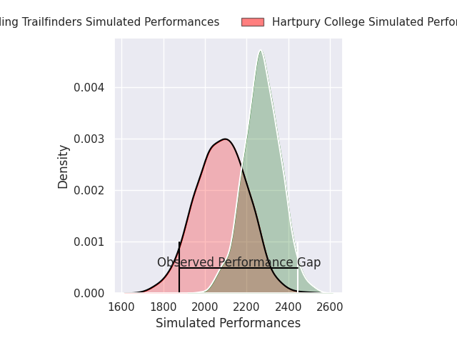
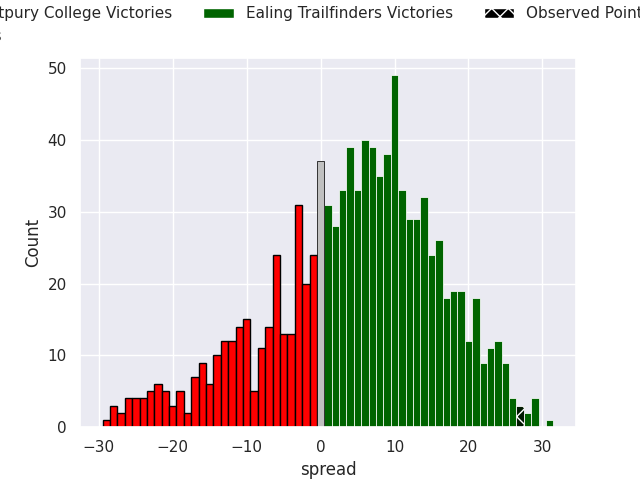
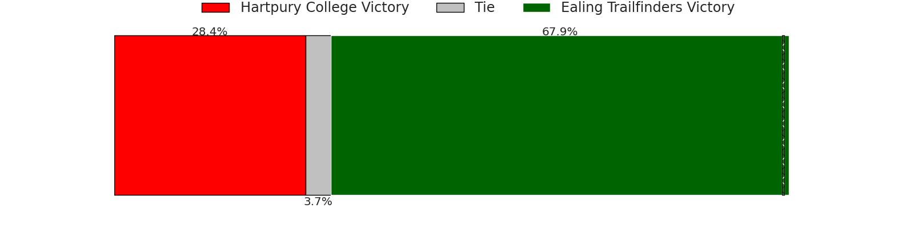
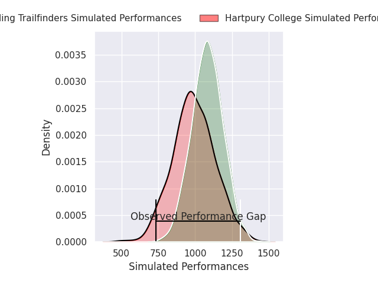
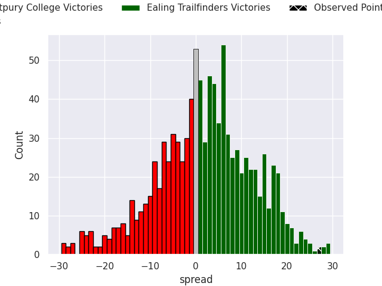
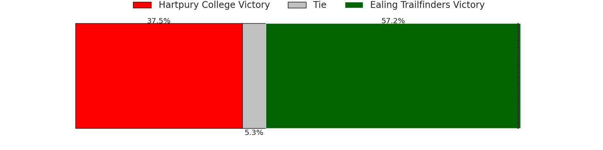

# Hartpury College V Ealing Trailfinders on 2026/02/14, 19.0 to 46.0

# Club Level Predictions

Now that the game has been played, lets see how the club predictions did. I predicted Ealing Trailfinders to win by 4.67, and Ealing Trailfinders won by 27.0. That's an absolute error of 22.3 for the margin of victory, while my average absolute error has been 13.4 over the past six months. This prediction was more accurate than 19.2% of my recent predictions.

For the Over/Under model, I predicted a total of 51.5 and we have an actual total of 65.0. That's an absolute error of 13.5 compared to a six month average of 12.8. This prediction was more accurate than 39.1% of my recent predictions.
## Projected Performances - Club Model

## Projected Spreads - Club Model

## Projected Results - Club Model

# Player Level Predictions

With the player model, I predicted Ealing Trailfinders to win by 2.06,  and Ealing Trailfinders won by 27.0. That's an absolute error of 24.9 for the margin of victory, while the average error as been 14.5 for the past six months. So this prediction was more accurate than 16.3% of my recent predictions.
## Projected Performances - Player Model

## Projected Spreads - Player Model

## Projected Results - Player Model

