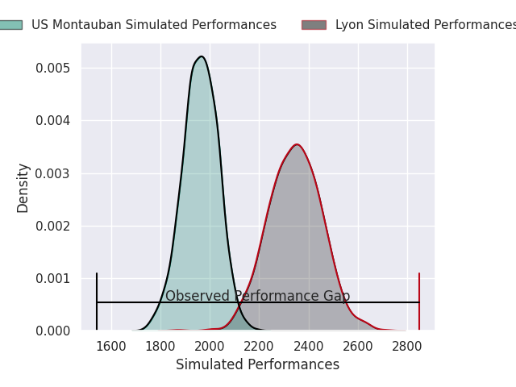
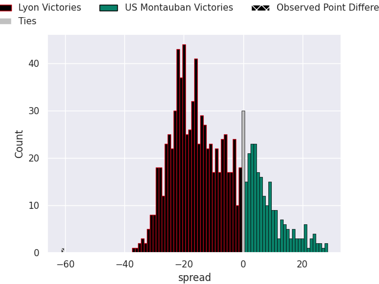
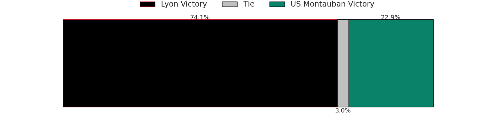
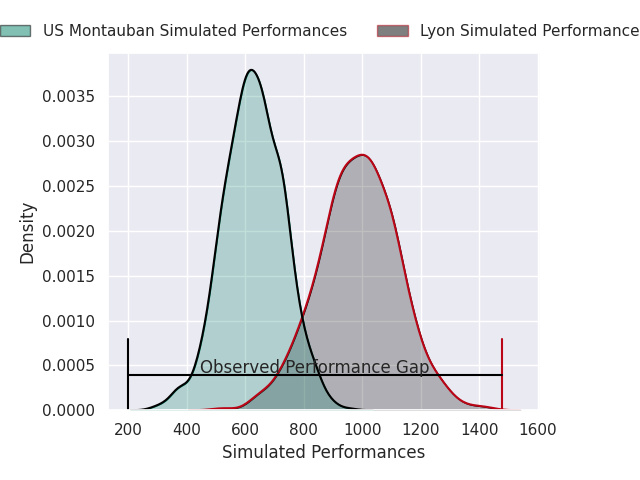
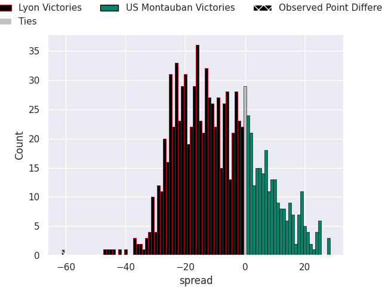
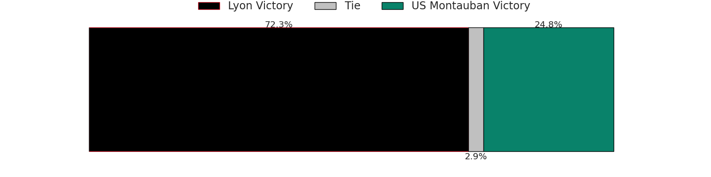

# Lyon V US Montauban on 2026/02/14, 73.0 to 12.0

# Club Level Predictions

Now that the game has been played, lets see how the club predictions did. I predicted Lyon to win by 10.22, and Lyon won by 61.0. That's an absolute error of 50.8 for the margin of victory, while my average absolute error has been 13.4 over the past six months. This prediction was more accurate than 1.4% of my recent predictions.

For the Over/Under model, I predicted a total of 49.5 and we have an actual total of 85.0. That's an absolute error of 35.5 compared to a six month average of 12.8. This prediction was more accurate than 2.9% of my recent predictions.
## Projected Performances - Club Model

## Projected Spreads - Club Model

## Projected Results - Club Model

# Player Level Predictions

With the player model, I predicted Lyon to win by 8.98,  and Lyon won by 61.0. That's an absolute error of 52.0 for the margin of victory, while the average error as been 14.5 for the past six months. So this prediction was more accurate than 1.7% of my recent predictions.
## Projected Performances - Player Model

## Projected Spreads - Player Model

## Projected Results - Player Model

