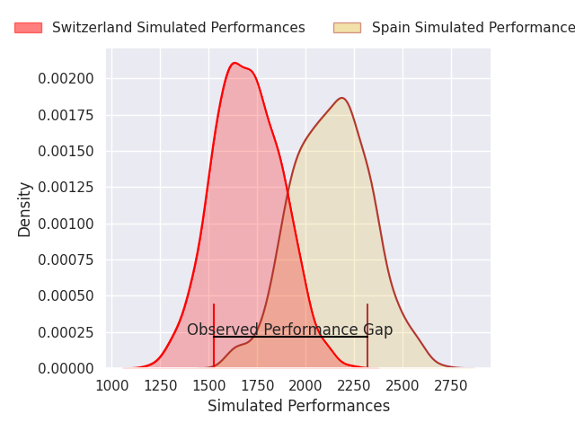
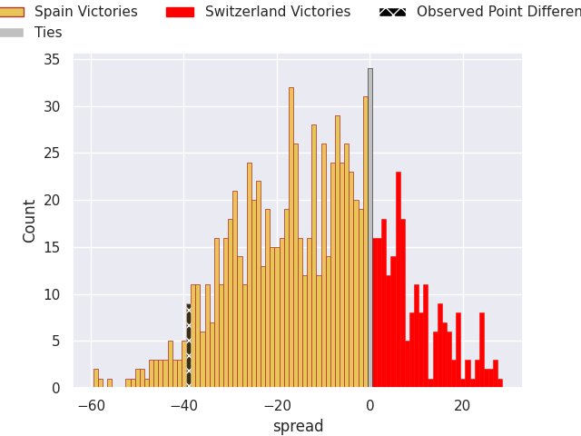
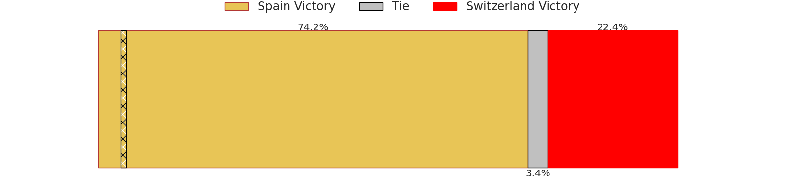

# Spain V Switzerland on 2026/02/14, 53.0 to 14.0

# Club Level Predictions

Now that the game has been played, lets see how the club predictions did. I predicted Spain to win by 11.82, and Spain won by 39.0. That's an absolute error of 27.2 for the margin of victory, while my average absolute error has been 13.5 over the past six months. This prediction was more accurate than 12.2% of my recent predictions.

For the Over/Under model, I predicted a total of 62.5 and we have an actual total of 67.0. That's an absolute error of 4.5 compared to a six month average of 12.8. This prediction was more accurate than 78.6% of my recent predictions.
## Projected Performances - Club Model

## Projected Spreads - Club Model

## Projected Results - Club Model

