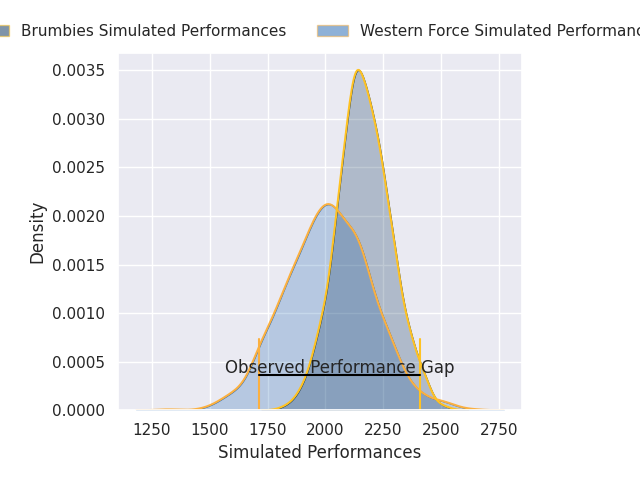
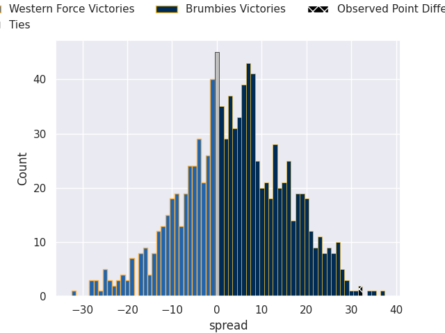

# Western Force V Brumbies on 2026/02/14, 24.0 to 56.0

# Club Level Predictions

Now that the game has been played, lets see how the club predictions did. I predicted Brumbies to win by 4.08, and Brumbies won by 32.0. That's an absolute error of 27.9 for the margin of victory, while my average absolute error has been 13.4 over the past six months. This prediction was more accurate than 11.5% of my recent predictions.

For the Over/Under model, I predicted a total of 46.5 and we have an actual total of 80.0. That's an absolute error of 33.5 compared to a six month average of 12.8. This prediction was more accurate than 3.7% of my recent predictions.
## Projected Performances - Club Model

## Projected Spreads - Club Model

## Projected Results - Club Model

