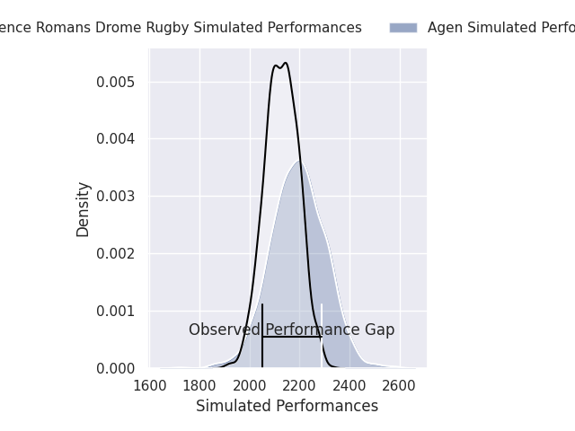
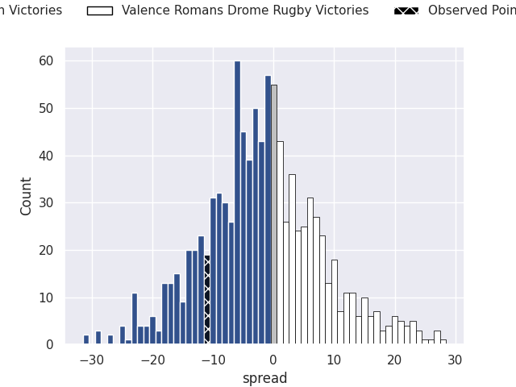
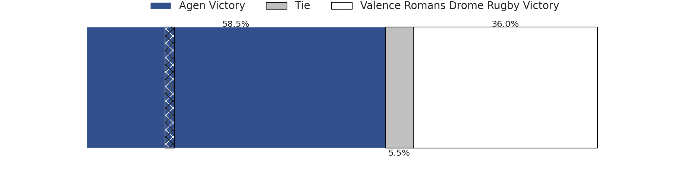
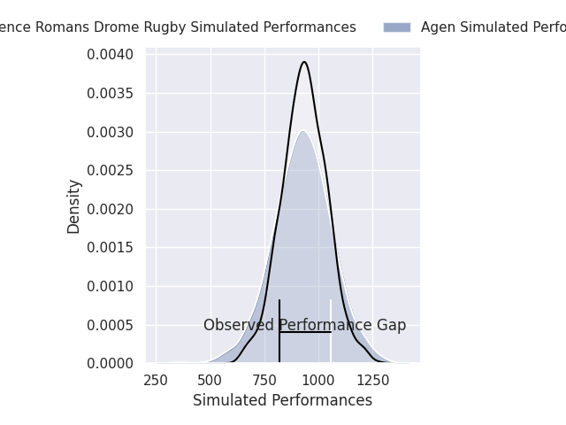
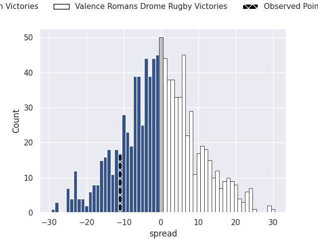
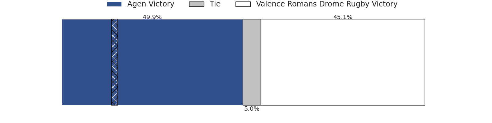

# Agen V Valence Romans Drome Rugby on 2026/02/20, 34.0 to 23.0

# Club Level Predictions

Now that the game has been played, lets see how the club predictions did. I predicted Agen to win by 1.97, and Agen won by 11.0. That's an absolute error of 9.0 for the margin of victory, while my average absolute error has been 13.3 over the past six months. This prediction was more accurate than 52.6% of my recent predictions.

For the Over/Under model, I predicted a total of 45.5 and we have an actual total of 57.0. That's an absolute error of 11.5 compared to a six month average of 12.9. This prediction was more accurate than 47.2% of my recent predictions.
## Projected Performances - Club Model

## Projected Spreads - Club Model

## Projected Results - Club Model

# Player Level Predictions

With the player model, I predicted Agen to win by 0.5,  and Agen won by 11.0. That's an absolute error of 10.5 for the margin of victory, while the average error as been 14.2 for the past six months. So this prediction was more accurate than 43.5% of my recent predictions.
## Projected Performances - Player Model

## Projected Spreads - Player Model

## Projected Results - Player Model

