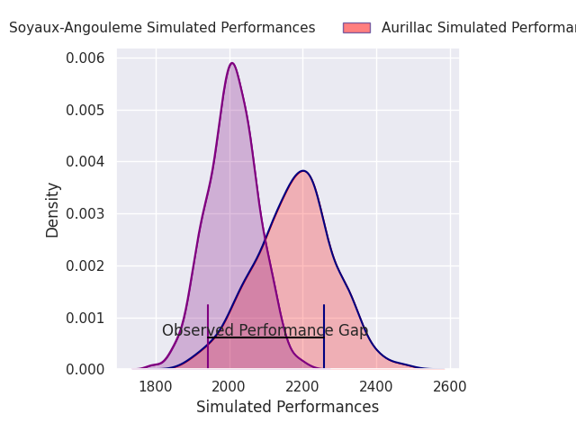
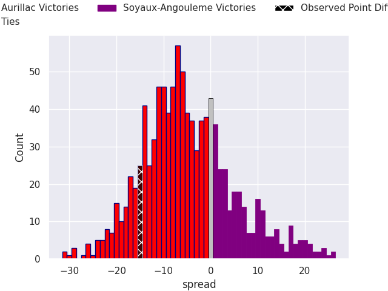
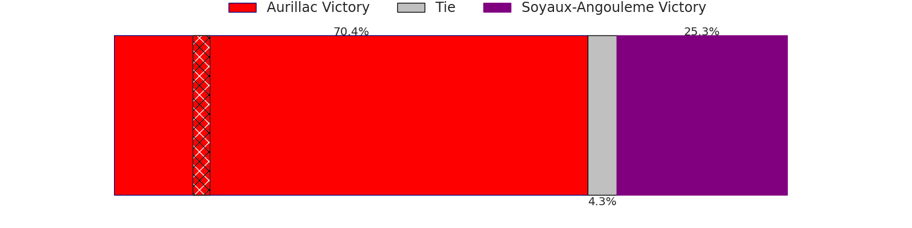
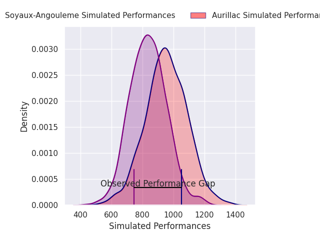
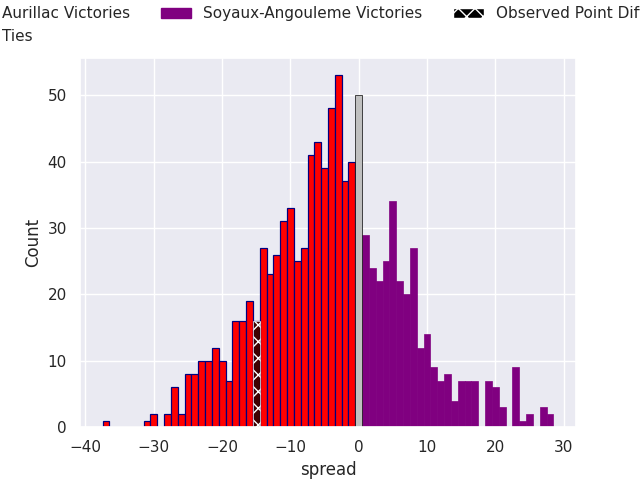
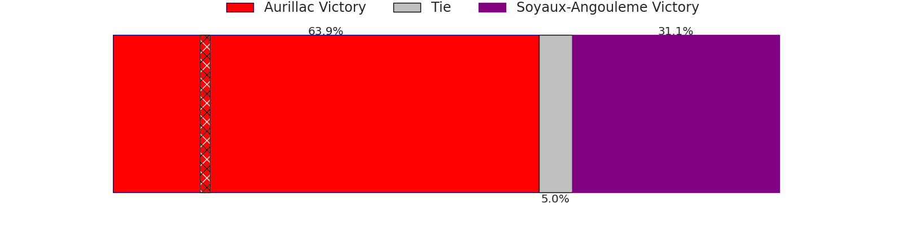

# Aurillac V Soyaux-Angouleme on 2026/02/20, 18.0 to 3.0

# Club Level Predictions

Now that the game has been played, lets see how the club predictions did. I predicted Aurillac to win by 4.87, and Aurillac won by 15.0. That's an absolute error of 10.1 for the margin of victory, while my average absolute error has been 13.3 over the past six months. This prediction was more accurate than 48.2% of my recent predictions.

For the Over/Under model, I predicted a total of 44.5 and we have an actual total of 21.0. That's an absolute error of 23.5 compared to a six month average of 12.9. This prediction was more accurate than 15.2% of my recent predictions.
## Projected Performances - Club Model

## Projected Spreads - Club Model

## Projected Results - Club Model

# Player Level Predictions

With the player model, I predicted Aurillac to win by 3.67,  and Aurillac won by 15.0. That's an absolute error of 11.3 for the margin of victory, while the average error as been 14.2 for the past six months. So this prediction was more accurate than 41.3% of my recent predictions.
## Projected Performances - Player Model

## Projected Spreads - Player Model

## Projected Results - Player Model

