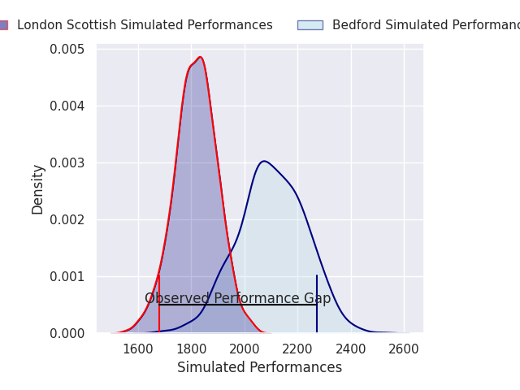
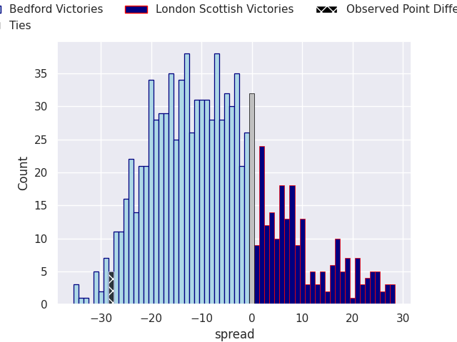
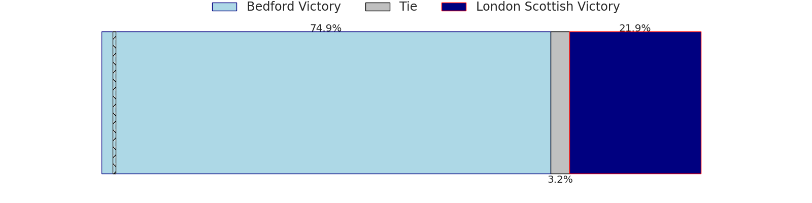

# Bedford V London Scottish on 2026/02/20, 54.0 to 26.0

# Club Level Predictions

Now that the game has been played, lets see how the club predictions did. I predicted Bedford to win by 7.69, and Bedford won by 28.0. That's an absolute error of 20.3 for the margin of victory, while my average absolute error has been 13.5 over the past six months. This prediction was more accurate than 22.5% of my recent predictions.

For the Over/Under model, I predicted a total of 45.5 and we have an actual total of 80.0. That's an absolute error of 34.5 compared to a six month average of 12.8. This prediction was more accurate than 3.1% of my recent predictions.
## Projected Performances - Club Model

## Projected Spreads - Club Model

## Projected Results - Club Model

