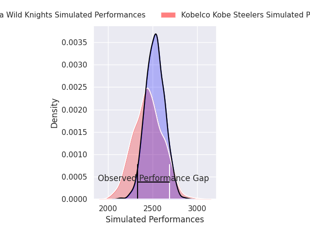
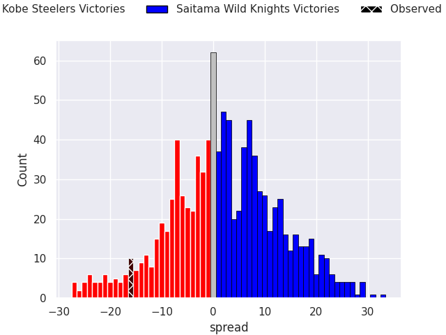
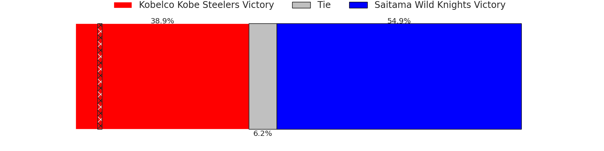

# Kobelco Kobe Steelers V Saitama Wild Knights on 2026/02/20, 40.0 to 24.0

# Club Level Predictions

Now that the game has been played, lets see how the club predictions did. I predicted Saitama Wild Knights to win by 2.06, and Kobelco Kobe Steelers won by 16.0. That's an absolute error of 18.1 for the margin of victory, while my average absolute error has been 13.5 over the past six months. This prediction was more accurate than 26.6% of my recent predictions.

For the Over/Under model, I predicted a total of 53.5 and we have an actual total of 64.0. That's an absolute error of 10.5 compared to a six month average of 12.8. This prediction was more accurate than 50.2% of my recent predictions.
## Projected Performances - Club Model

## Projected Spreads - Club Model

## Projected Results - Club Model

