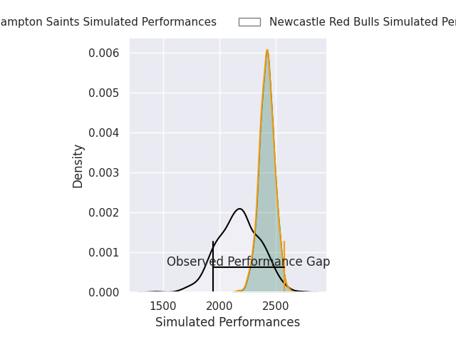
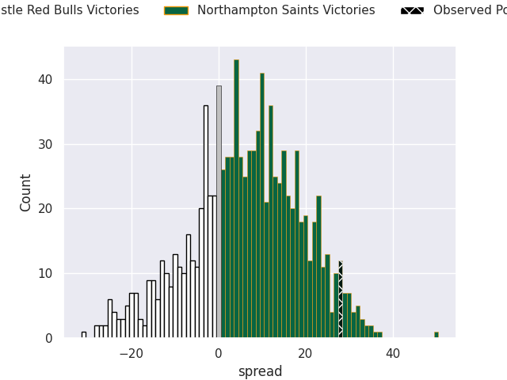
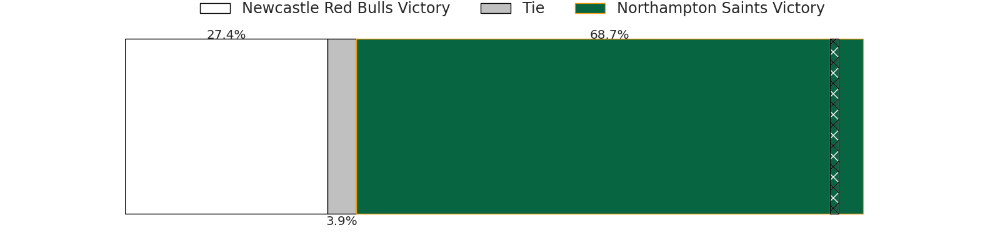
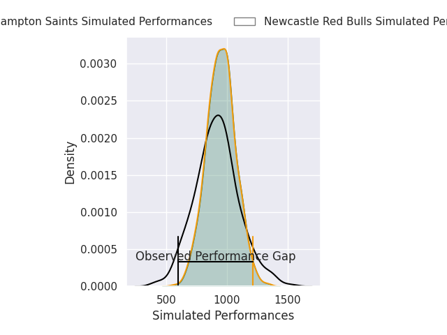
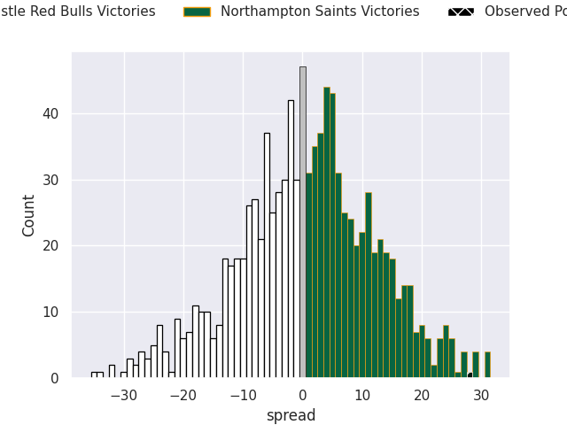
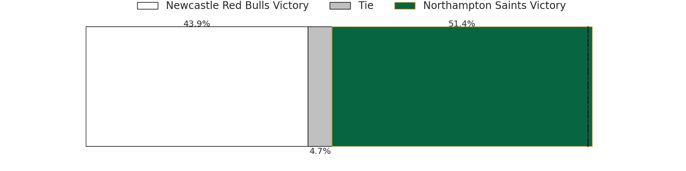

# Newcastle Red Bulls V Northampton Saints on 2026/02/20, 21.0 to 49.0

# Club Level Predictions

Now that the game has been played, lets see how the club predictions did. I predicted Northampton Saints to win by 6.4, and Northampton Saints won by 28.0. That's an absolute error of 21.6 for the margin of victory, while my average absolute error has been 13.3 over the past six months. This prediction was more accurate than 20.0% of my recent predictions.

For the Over/Under model, I predicted a total of 51.5 and we have an actual total of 70.0. That's an absolute error of 18.5 compared to a six month average of 12.9. This prediction was more accurate than 24.5% of my recent predictions.
## Projected Performances - Club Model

## Projected Spreads - Club Model

## Projected Results - Club Model

# Player Level Predictions

With the player model, I predicted Northampton Saints to win by 0.76,  and Northampton Saints won by 28.0. That's an absolute error of 27.2 for the margin of victory, while the average error as been 13.4 for the past six months. So this prediction was more accurate than 11.9% of my recent predictions.
## Projected Performances - Player Model

## Projected Spreads - Player Model

## Projected Results - Player Model

