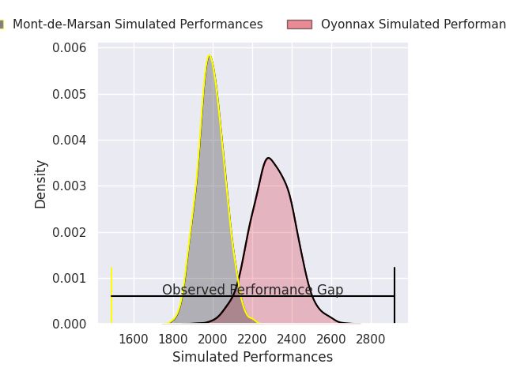
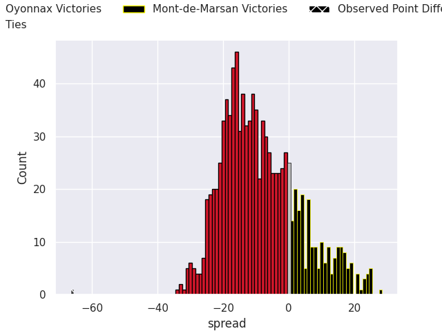

# Oyonnax V Mont-de-Marsan on 2026/02/20, 73.0 to 7.0

# Club Level Predictions

Now that the game has been played, lets see how the club predictions did. I predicted Oyonnax to win by 8.59, and Oyonnax won by 66.0. That's an absolute error of 57.4 for the margin of victory, while my average absolute error has been 13.3 over the past six months. This prediction was more accurate than 0.4% of my recent predictions.

For the Over/Under model, I predicted a total of 48.5 and we have an actual total of 80.0. That's an absolute error of 31.5 compared to a six month average of 12.9. This prediction was more accurate than 5.8% of my recent predictions.
## Projected Performances - Club Model

## Projected Spreads - Club Model

## Projected Results - Club Model

