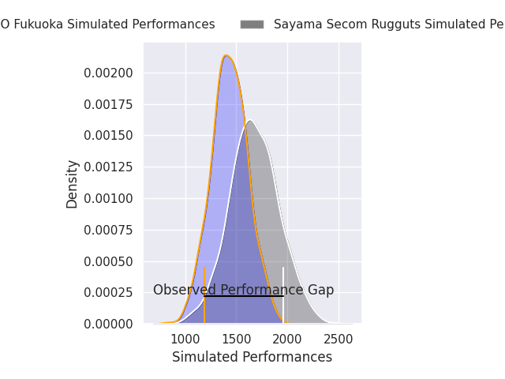
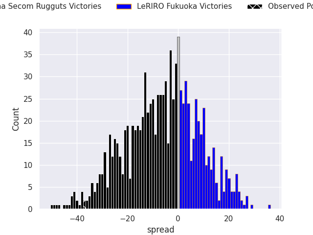
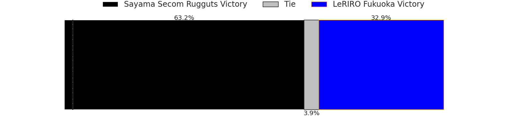
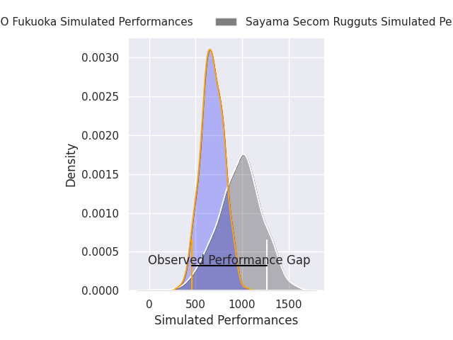
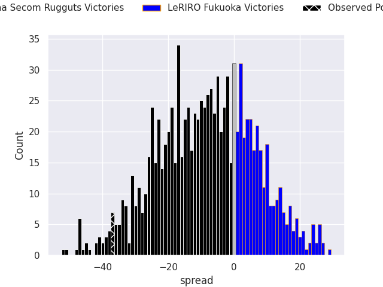
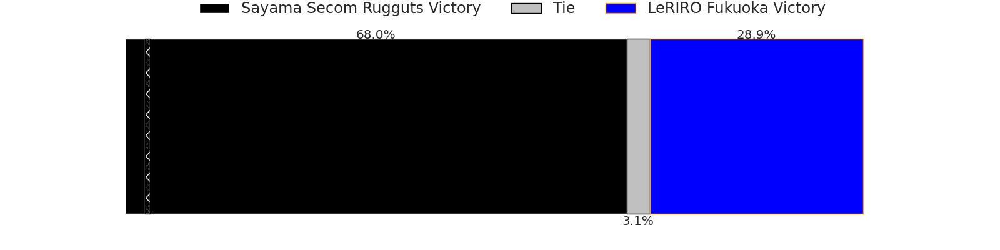

# Sayama Secom Rugguts V LeRIRO Fukuoka on 2026/02/20, 44.0 to 7.0

# Club Level Predictions

Now that the game has been played, lets see how the club predictions did. I predicted Sayama Secom Rugguts to win by 6.26, and Sayama Secom Rugguts won by 37.0. That's an absolute error of 30.7 for the margin of victory, while my average absolute error has been 13.3 over the past six months. This prediction was more accurate than 9.6% of my recent predictions.

For the Over/Under model, I predicted a total of 48.5 and we have an actual total of 51.0. That's an absolute error of 2.5 compared to a six month average of 12.9. This prediction was more accurate than 88.4% of my recent predictions.
## Projected Performances - Club Model

## Projected Spreads - Club Model

## Projected Results - Club Model

# Player Level Predictions

With the player model, I predicted Sayama Secom Rugguts to win by 8.59,  and Sayama Secom Rugguts won by 37.0. That's an absolute error of 28.4 for the margin of victory, while the average error as been 13.4 for the past six months. So this prediction was more accurate than 10.8% of my recent predictions.
## Projected Performances - Player Model

## Projected Spreads - Player Model

## Projected Results - Player Model

