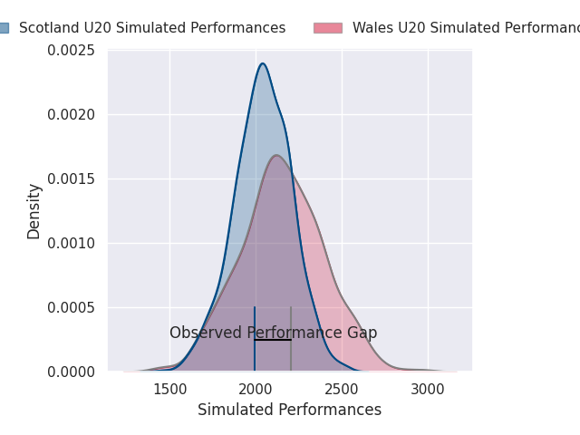
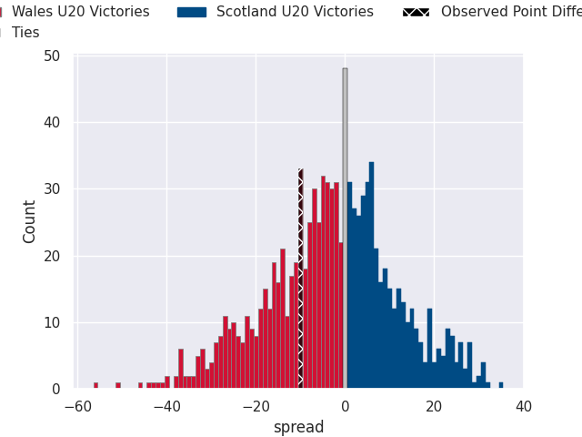

# Wales U20 V Scotland U20 on 2026/02/20, 31.0 to 21.0

# Club Level Predictions

Now that the game has been played, lets see how the club predictions did. I predicted Wales U20 to win by 3.1, and Wales U20 won by 10.0. That's an absolute error of 6.9 for the margin of victory, while my average absolute error has been 13.3 over the past six months. This prediction was more accurate than 63.3% of my recent predictions.

For the Over/Under model, I predicted a total of 48.5 and we have an actual total of 52.0. That's an absolute error of 3.5 compared to a six month average of 12.9. This prediction was more accurate than 83.5% of my recent predictions.
## Projected Performances - Club Model

## Projected Spreads - Club Model

## Projected Results - Club Model

