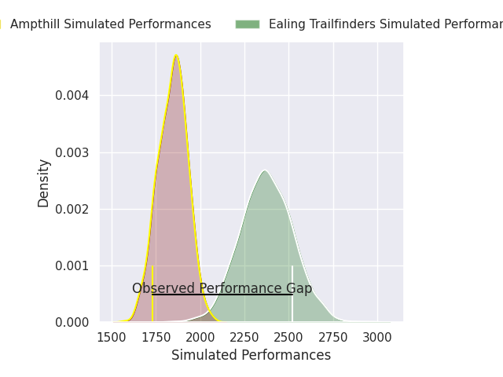
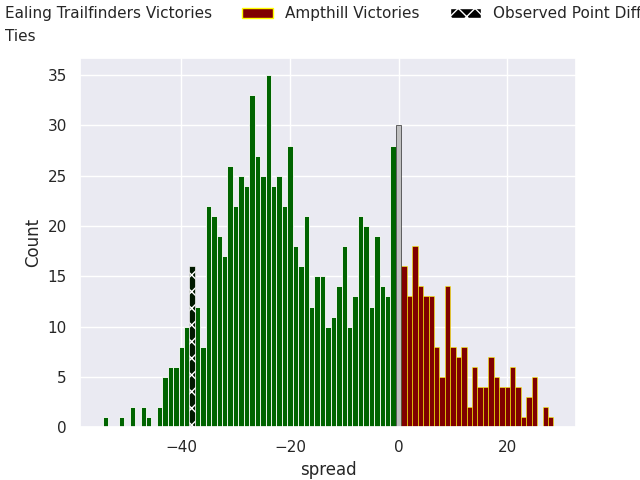
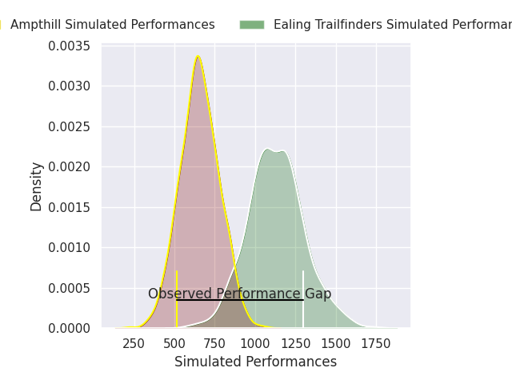
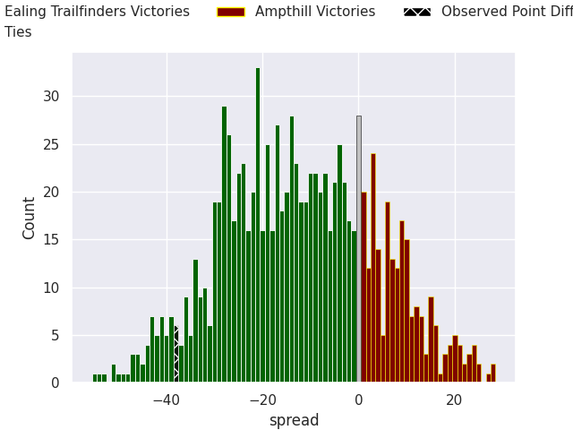
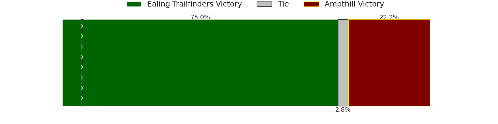

# Ealing Trailfinders V Ampthill on 2026/02/21, 50.0 to 12.0

# Club Level Predictions

Now that the game has been played, lets see how the club predictions did. I predicted Ealing Trailfinders to win by 14.91, and Ealing Trailfinders won by 38.0. That's an absolute error of 23.1 for the margin of victory, while my average absolute error has been 13.3 over the past six months. This prediction was more accurate than 17.9% of my recent predictions.

For the Over/Under model, I predicted a total of 53.5 and we have an actual total of 62.0. That's an absolute error of 8.5 compared to a six month average of 12.9. This prediction was more accurate than 59.7% of my recent predictions.
## Projected Performances - Club Model

## Projected Spreads - Club Model

## Projected Results - Club Model

# Player Level Predictions

With the player model, I predicted Ealing Trailfinders to win by 12.42,  and Ealing Trailfinders won by 38.0. That's an absolute error of 25.6 for the margin of victory, while the average error as been 13.4 for the past six months. So this prediction was more accurate than 13.3% of my recent predictions.
## Projected Performances - Player Model

## Projected Spreads - Player Model

## Projected Results - Player Model

