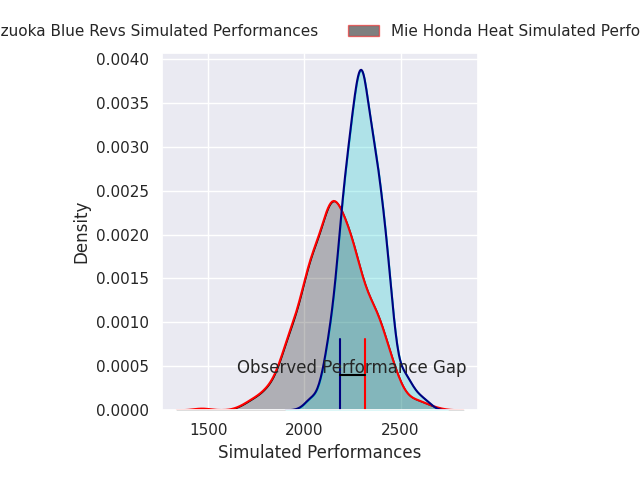
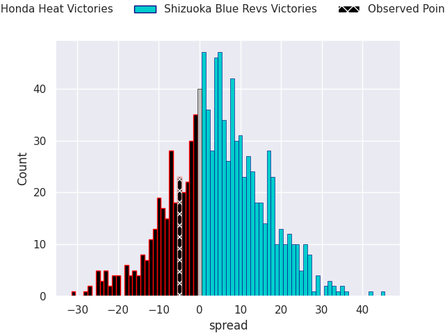
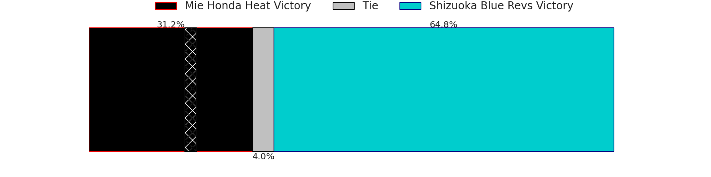
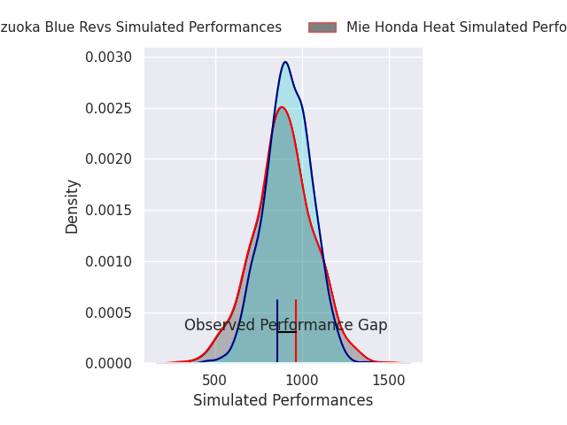
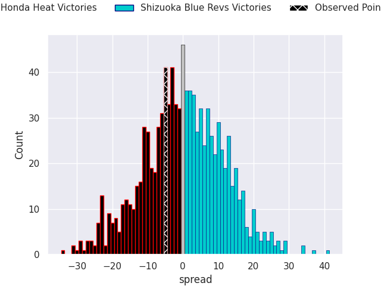
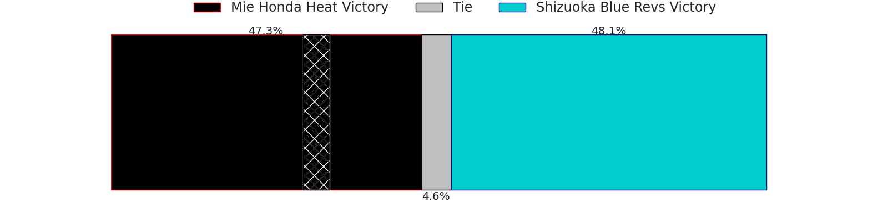

# Mie Honda Heat V Shizuoka Blue Revs on 2026/02/21, 26.0 to 21.0

# Club Level Predictions

Now that the game has been played, lets see how the club predictions did. I predicted Shizuoka Blue Revs to win by 4.49, and Mie Honda Heat won by 5.0. That's an absolute error of 9.5 for the margin of victory, while my average absolute error has been 13.5 over the past six months. This prediction was more accurate than 51.1% of my recent predictions.

For the Over/Under model, I predicted a total of 51.5 and we have an actual total of 47.0. That's an absolute error of 4.5 compared to a six month average of 12.8. This prediction was more accurate than 78.5% of my recent predictions.
## Projected Performances - Club Model

## Projected Spreads - Club Model

## Projected Results - Club Model

# Player Level Predictions

With the player model, I predicted Shizuoka Blue Revs to win by 0.11,  and Mie Honda Heat won by 5.0. That's an absolute error of 5.1 for the margin of victory, while the average error as been 14.5 for the past six months. So this prediction was more accurate than 64.5% of my recent predictions.
## Projected Performances - Player Model

## Projected Spreads - Player Model

## Projected Results - Player Model

