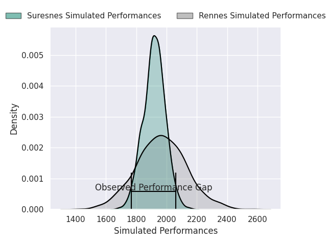
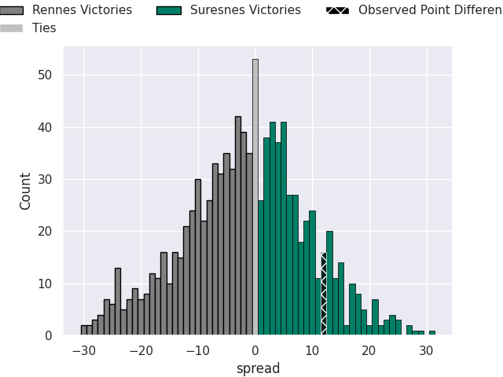
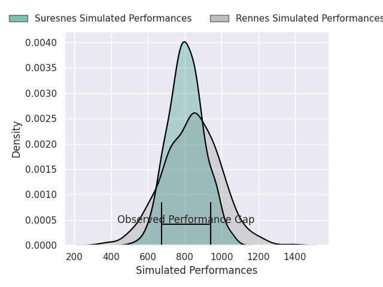
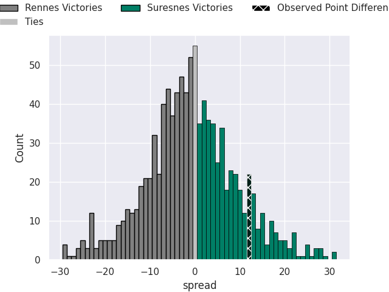
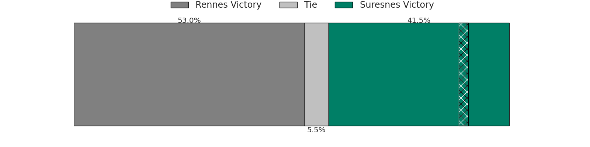

# Rennes V Suresnes on 2026/02/21, 7.0 to 19.0

# Club Level Predictions

Now that the game has been played, lets see how the club predictions did. I predicted Rennes to win by 1.61, and Suresnes won by 12.0. That's an absolute error of 13.6 for the margin of victory, while my average absolute error has been 13.3 over the past six months. This prediction was more accurate than 36.5% of my recent predictions.

For the Over/Under model, I predicted a total of 37.5 and we have an actual total of 26.0. That's an absolute error of 11.5 compared to a six month average of 12.9. This prediction was more accurate than 47.1% of my recent predictions.
## Projected Performances - Club Model

## Projected Spreads - Club Model

## Projected Results - Club Model

# Player Level Predictions

With the player model, I predicted Rennes to win by 0.84,  and Suresnes won by 12.0. That's an absolute error of 12.8 for the margin of victory, while the average error as been 13.4 for the past six months. So this prediction was more accurate than 34.0% of my recent predictions.
## Projected Performances - Player Model

## Projected Spreads - Player Model

## Projected Results - Player Model

