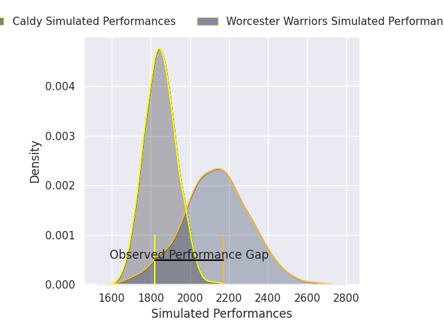
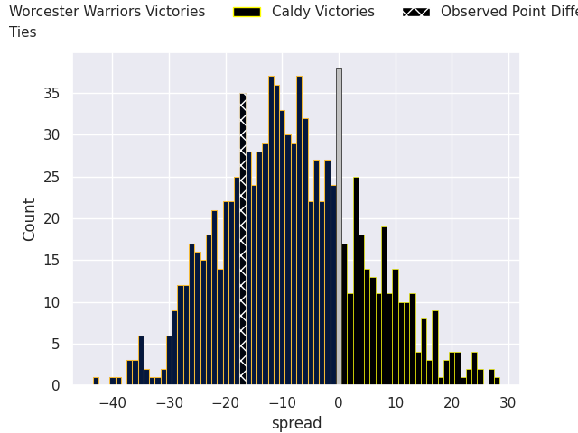
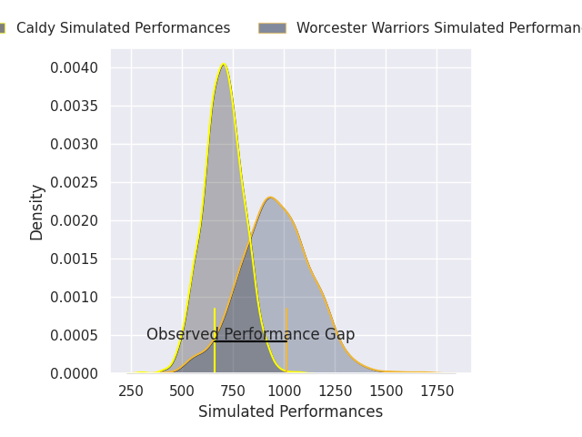
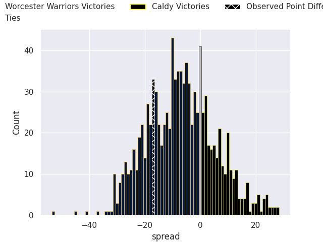

# Worcester Warriors V Caldy on 2026/02/21, 50.0 to 33.0

# Club Level Predictions

Now that the game has been played, lets see how the club predictions did. I predicted Worcester Warriors to win by 8.1, and Worcester Warriors won by 17.0. That's an absolute error of 8.9 for the margin of victory, while my average absolute error has been 13.3 over the past six months. This prediction was more accurate than 53.1% of my recent predictions.

For the Over/Under model, I predicted a total of 47.5 and we have an actual total of 83.0. That's an absolute error of 35.5 compared to a six month average of 12.9. This prediction was more accurate than 2.9% of my recent predictions.
## Projected Performances - Club Model

## Projected Spreads - Club Model

## Projected Results - Club Model

# Player Level Predictions

With the player model, I predicted Worcester Warriors to win by 6.84,  and Worcester Warriors won by 17.0. That's an absolute error of 10.2 for the margin of victory, while the average error as been 14.2 for the past six months. So this prediction was more accurate than 44.1% of my recent predictions.
## Projected Performances - Player Model

## Projected Spreads - Player Model

## Projected Results - Player Model

