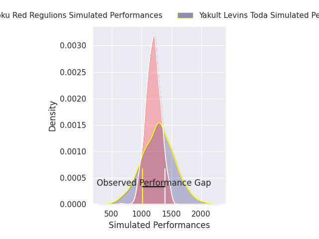
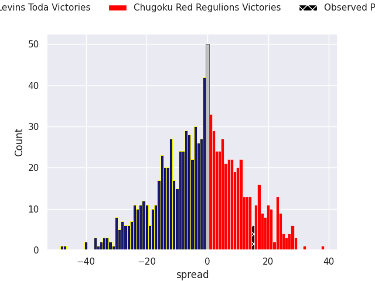
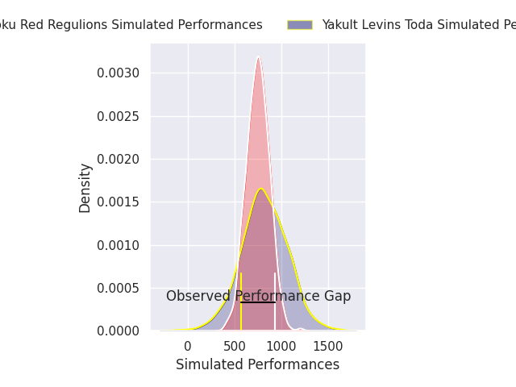
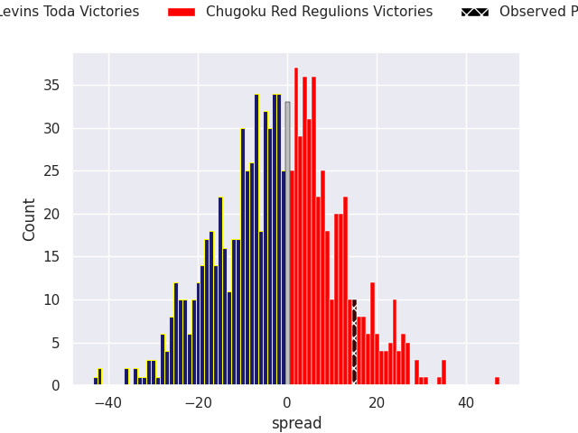
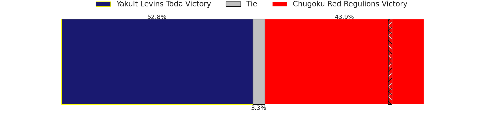

# Yakult Levins Toda V Chugoku Red Regulions on 2026/02/21, 10.0 to 25.0

# Club Level Predictions

Now that the game has been played, lets see how the club predictions did. I predicted Yakult Levins Toda to win by 2.03, and Chugoku Red Regulions won by 15.0. That's an absolute error of 17.0 for the margin of victory, while my average absolute error has been 13.5 over the past six months. This prediction was more accurate than 28.2% of my recent predictions.

For the Over/Under model, I predicted a total of 49.5 and we have an actual total of 35.0. That's an absolute error of 14.5 compared to a six month average of 12.8. This prediction was more accurate than 36.0% of my recent predictions.
## Projected Performances - Club Model

## Projected Spreads - Club Model

## Projected Results - Club Model

# Player Level Predictions

With the player model, I predicted Yakult Levins Toda to win by 1.8,  and Chugoku Red Regulions won by 15.0. That's an absolute error of 16.8 for the margin of victory, while the average error as been 14.5 for the past six months. So this prediction was more accurate than 28.6% of my recent predictions.
## Projected Performances - Player Model

## Projected Spreads - Player Model

## Projected Results - Player Model

