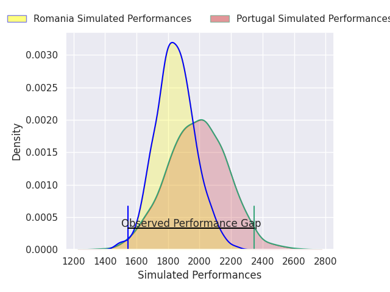
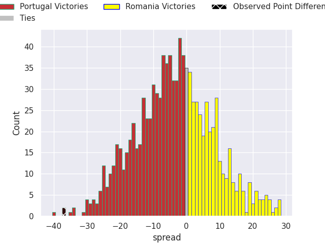

# Portugal V Romania on 2026/02/22, 44.0 to 7.0

# Club Level Predictions

Now that the game has been played, lets see how the club predictions did. I predicted Portugal to win by 3.71, and Portugal won by 37.0. That's an absolute error of 33.3 for the margin of victory, while my average absolute error has been 13.3 over the past six months. This prediction was more accurate than 6.9% of my recent predictions.

For the Over/Under model, I predicted a total of 51.5 and we have an actual total of 51.0. That's an absolute error of 0.5 compared to a six month average of 12.9. This prediction was more accurate than 97.6% of my recent predictions.
## Projected Performances - Club Model

## Projected Spreads - Club Model

## Projected Results - Club Model

