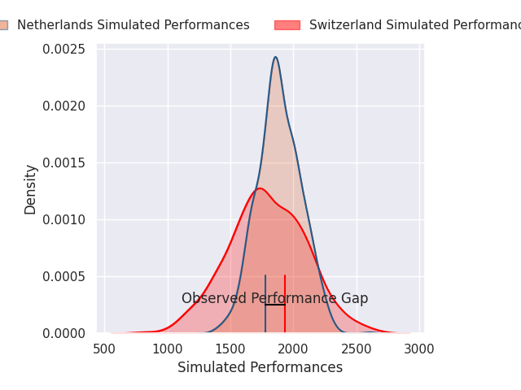
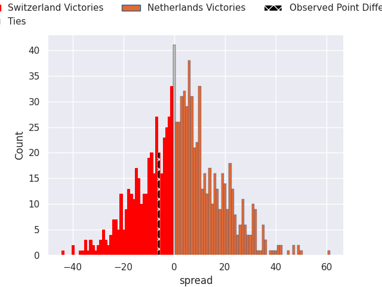

# Switzerland V Netherlands on 2026/02/22, 29.0 to 23.0

# Club Level Predictions

Now that the game has been played, lets see how the club predictions did. I predicted Netherlands to win by 2.7, and Switzerland won by 6.0. That's an absolute error of 8.7 for the margin of victory, while my average absolute error has been 13.3 over the past six months. This prediction was more accurate than 54.5% of my recent predictions.

For the Over/Under model, I predicted a total of 62.5 and we have an actual total of 52.0. That's an absolute error of 10.5 compared to a six month average of 12.9. This prediction was more accurate than 51.0% of my recent predictions.
## Projected Performances - Club Model

## Projected Spreads - Club Model

## Projected Results - Club Model

