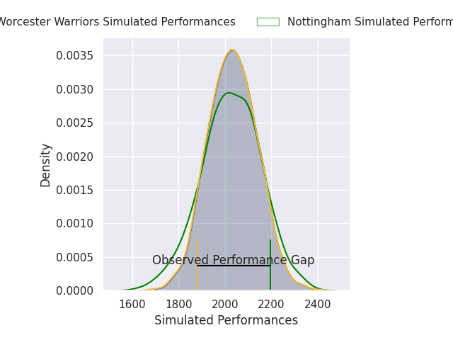
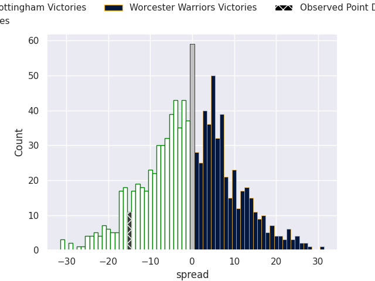
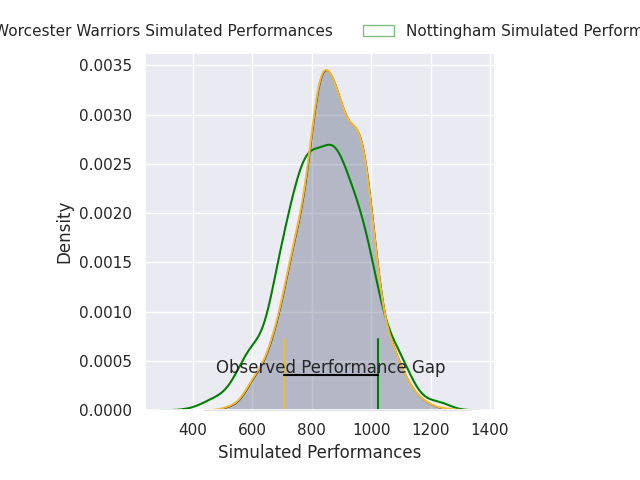
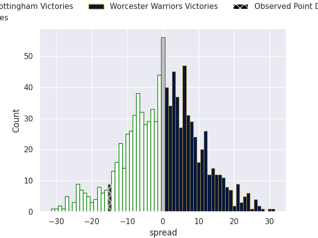
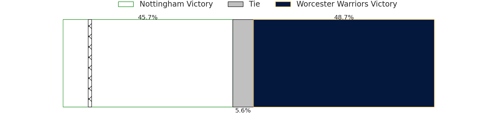

# Nottingham V Worcester Warriors on 2026/02/27, 22.0 to 7.0

# Club Level Predictions

Now that the game has been played, lets see how the club predictions did. I predicted Nottingham to win by 0.57, and Nottingham won by 15.0. That's an absolute error of 14.4 for the margin of victory, while my average absolute error has been 13.2 over the past six months. This prediction was more accurate than 34.6% of my recent predictions.

For the Over/Under model, I predicted a total of 48.5 and we have an actual total of 29.0. That's an absolute error of 19.5 compared to a six month average of 13.0. This prediction was more accurate than 22.4% of my recent predictions.
## Projected Performances - Club Model

## Projected Spreads - Club Model

## Projected Results - Club Model

# Player Level Predictions

With the player model, I predicted Worcester Warriors to win by 0.12,  and Nottingham won by 15.0. That's an absolute error of 15.1 for the margin of victory, while the average error as been 13.2 for the past six months. So this prediction was more accurate than 27.3% of my recent predictions.
## Projected Performances - Player Model

## Projected Spreads - Player Model

## Projected Results - Player Model

