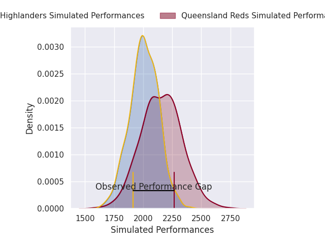
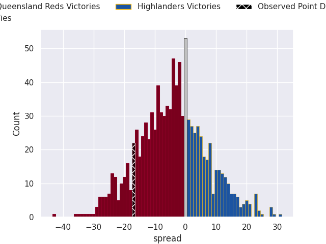

# Queensland Reds V Highlanders on 2026/02/27, 31.0 to 14.0

# Club Level Predictions

Now that the game has been played, lets see how the club predictions did. I predicted Queensland Reds to win by 4.24, and Queensland Reds won by 17.0. That's an absolute error of 12.8 for the margin of victory, while my average absolute error has been 13.3 over the past six months. This prediction was more accurate than 39.2% of my recent predictions.

For the Over/Under model, I predicted a total of 47.5 and we have an actual total of 45.0. That's an absolute error of 2.5 compared to a six month average of 12.9. This prediction was more accurate than 88.4% of my recent predictions.
## Projected Performances - Club Model

## Projected Spreads - Club Model

## Projected Results - Club Model

