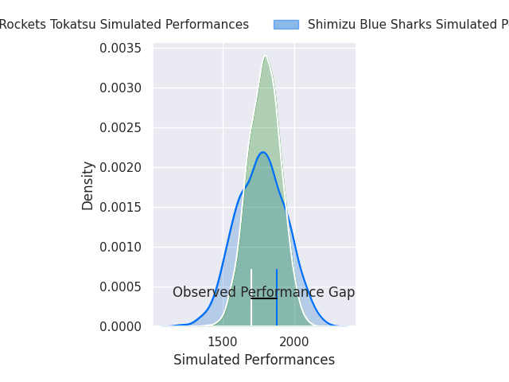
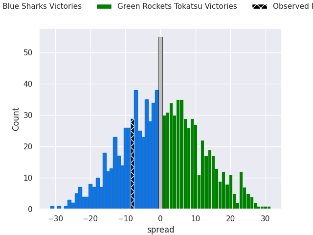
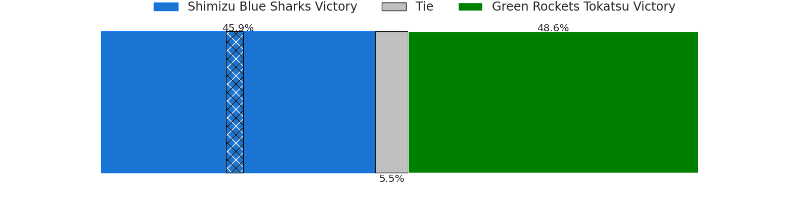
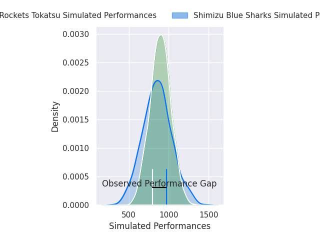
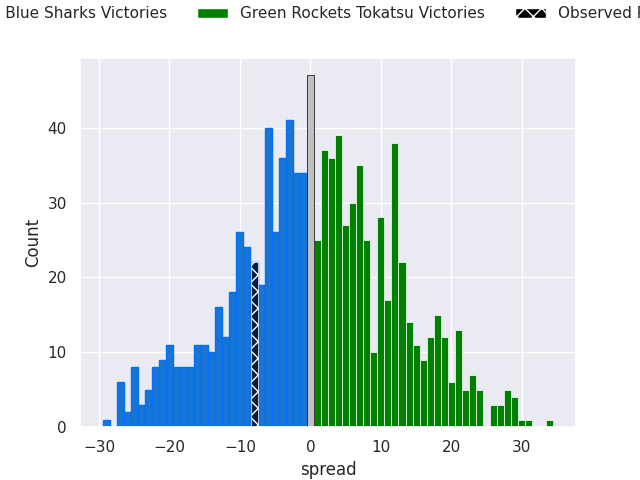
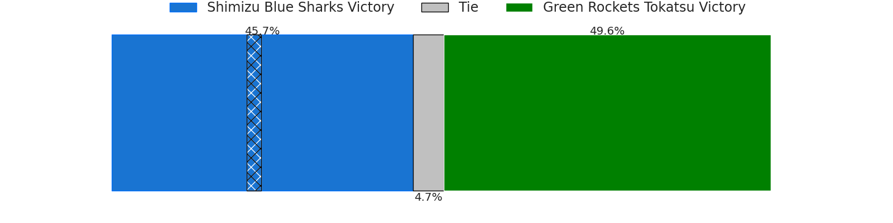

# Shimizu Blue Sharks V Green Rockets Tokatsu on 2026/02/27, 22.0 to 14.0

# Club Level Predictions

Now that the game has been played, lets see how the club predictions did. I predicted Green Rockets Tokatsu to win by 0.56, and Shimizu Blue Sharks won by 8.0. That's an absolute error of 8.6 for the margin of victory, while my average absolute error has been 13.3 over the past six months. This prediction was more accurate than 55.2% of my recent predictions.

For the Over/Under model, I predicted a total of 48.5 and we have an actual total of 36.0. That's an absolute error of 12.5 compared to a six month average of 12.9. This prediction was more accurate than 41.9% of my recent predictions.
## Projected Performances - Club Model

## Projected Spreads - Club Model

## Projected Results - Club Model

# Player Level Predictions

With the player model, I predicted Green Rockets Tokatsu to win by 0.72,  and Shimizu Blue Sharks won by 8.0. That's an absolute error of 8.7 for the margin of victory, while the average error as been 13.4 for the past six months. So this prediction was more accurate than 49.3% of my recent predictions.
## Projected Performances - Player Model

## Projected Spreads - Player Model

## Projected Results - Player Model

