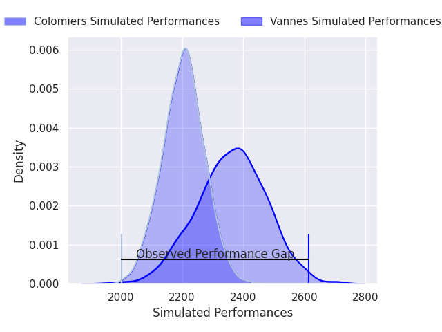
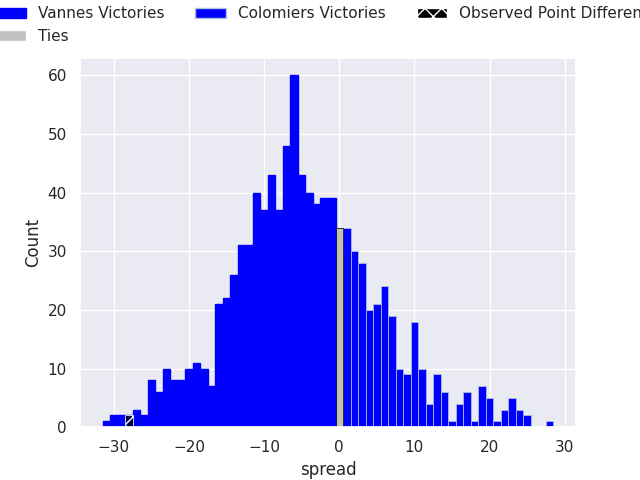
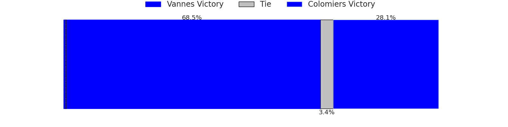
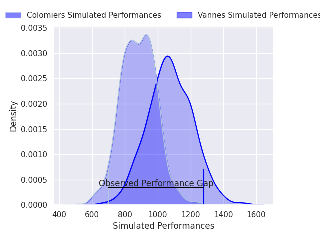
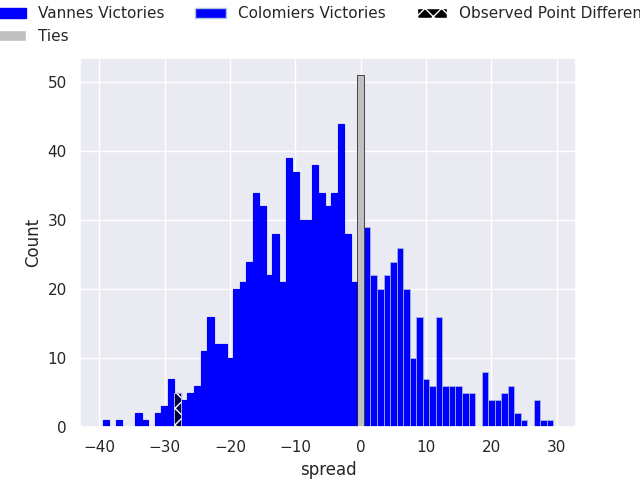
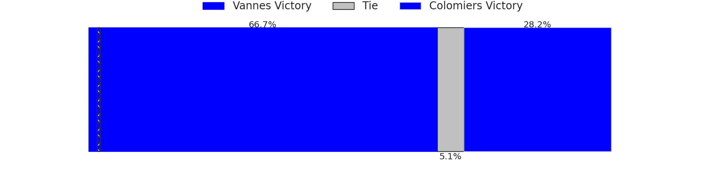

# Vannes V Colomiers on 2026/02/27, 40.0 to 12.0

# Club Level Predictions

Now that the game has been played, lets see how the club predictions did. I predicted Vannes to win by 4.44, and Vannes won by 28.0. That's an absolute error of 23.6 for the margin of victory, while my average absolute error has been 13.2 over the past six months. This prediction was more accurate than 16.2% of my recent predictions.

For the Over/Under model, I predicted a total of 46.5 and we have an actual total of 52.0. That's an absolute error of 5.5 compared to a six month average of 13.0. This prediction was more accurate than 73.4% of my recent predictions.
## Projected Performances - Club Model

## Projected Spreads - Club Model

## Projected Results - Club Model

# Player Level Predictions

With the player model, I predicted Vannes to win by 5.4,  and Vannes won by 28.0. That's an absolute error of 22.6 for the margin of victory, while the average error as been 13.2 for the past six months. So this prediction was more accurate than 16.2% of my recent predictions.
## Projected Performances - Player Model

## Projected Spreads - Player Model

## Projected Results - Player Model

