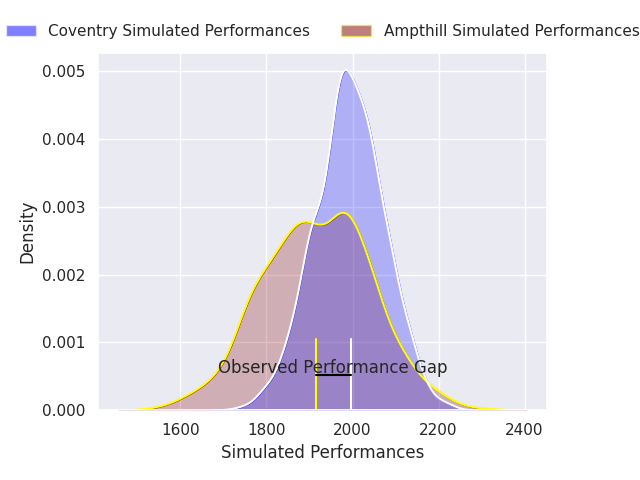
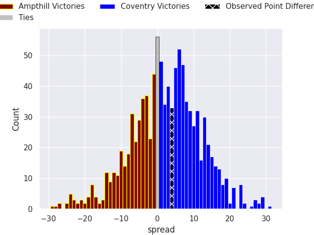
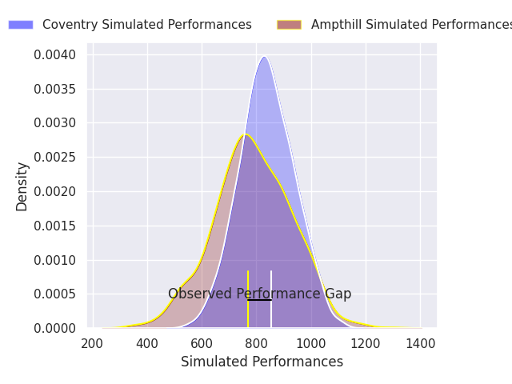
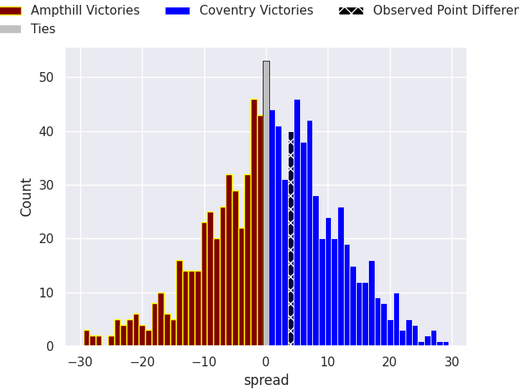

# Ampthill V Coventry on 2026/02/28, 36.0 to 40.0

# Club Level Predictions

Now that the game has been played, lets see how the club predictions did. I predicted Coventry to win by 2.36, and Coventry won by 4.0. That's an absolute error of 1.6 for the margin of victory, while my average absolute error has been 13.2 over the past six months. This prediction was more accurate than 90.4% of my recent predictions.

For the Over/Under model, I predicted a total of 49.5 and we have an actual total of 76.0. That's an absolute error of 26.5 compared to a six month average of 12.9. This prediction was more accurate than 11.4% of my recent predictions.
## Projected Performances - Club Model

## Projected Spreads - Club Model

## Projected Results - Club Model

# Player Level Predictions

With the player model, I predicted Coventry to win by 1.03,  and Coventry won by 4.0. That's an absolute error of 3.0 for the margin of victory, while the average error as been 13.2 for the past six months. So this prediction was more accurate than 73.9% of my recent predictions.
## Projected Performances - Player Model

## Projected Spreads - Player Model

## Projected Results - Player Model

