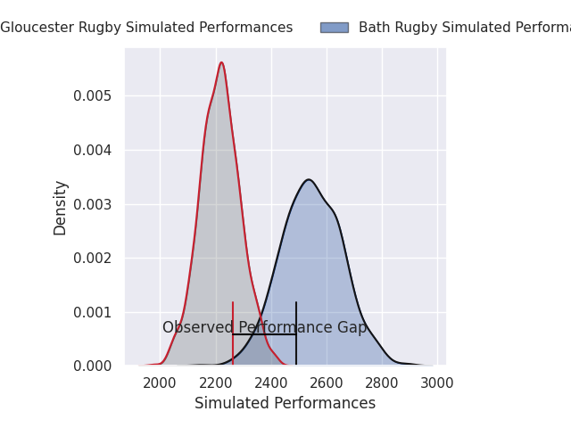
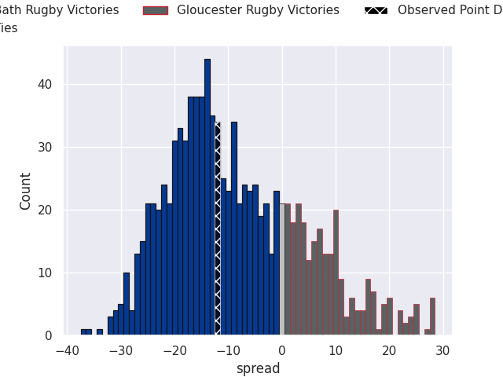
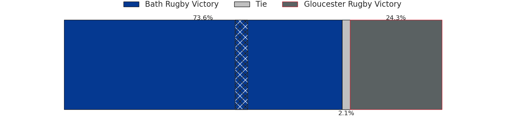
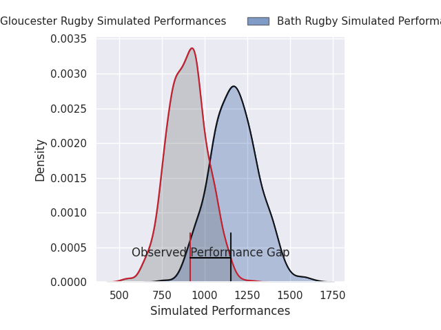
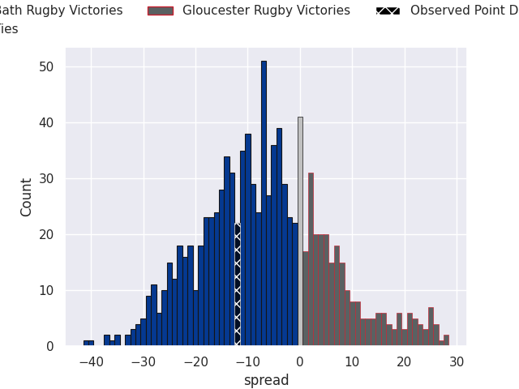

# Bath Rugby V Gloucester Rugby on 2026/02/28, 38.0 to 26.0

# Club Level Predictions

Now that the game has been played, lets see how the club predictions did. I predicted Bath Rugby to win by 8.55, and Bath Rugby won by 12.0. That's an absolute error of 3.4 for the margin of victory, while my average absolute error has been 13.3 over the past six months. This prediction was more accurate than 82.1% of my recent predictions.

For the Over/Under model, I predicted a total of 52.5 and we have an actual total of 64.0. That's an absolute error of 11.5 compared to a six month average of 12.9. This prediction was more accurate than 47.0% of my recent predictions.
## Projected Performances - Club Model

## Projected Spreads - Club Model

## Projected Results - Club Model

# Player Level Predictions

With the player model, I predicted Bath Rugby to win by 6.66,  and Bath Rugby won by 12.0. That's an absolute error of 5.3 for the margin of victory, while the average error as been 13.4 for the past six months. So this prediction was more accurate than 63.5% of my recent predictions.
## Projected Performances - Player Model

## Projected Spreads - Player Model

## Projected Results - Player Model

