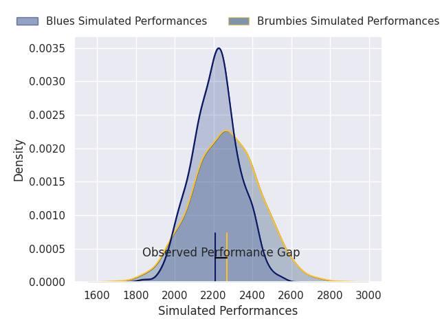
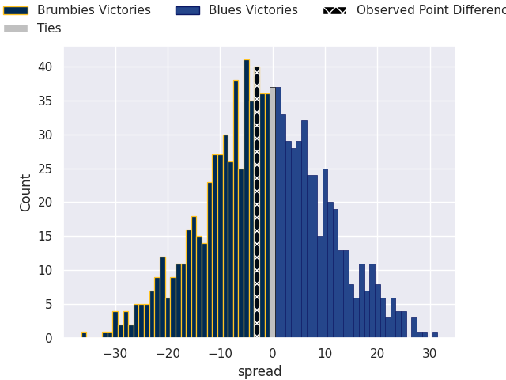

# Brumbies V Blues on 2026/02/28, 30.0 to 27.0

# Club Level Predictions

Now that the game has been played, lets see how the club predictions did. I predicted Brumbies to win by 1.56, and Brumbies won by 3.0. That's an absolute error of 1.4 for the margin of victory, while my average absolute error has been 13.2 over the past six months. This prediction was more accurate than 91.3% of my recent predictions.

For the Over/Under model, I predicted a total of 48.5 and we have an actual total of 57.0. That's an absolute error of 8.5 compared to a six month average of 12.9. This prediction was more accurate than 59.2% of my recent predictions.
## Projected Performances - Club Model

## Projected Spreads - Club Model

## Projected Results - Club Model

