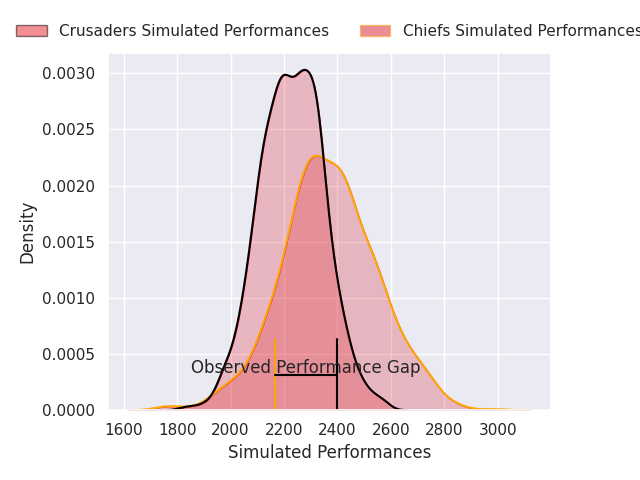
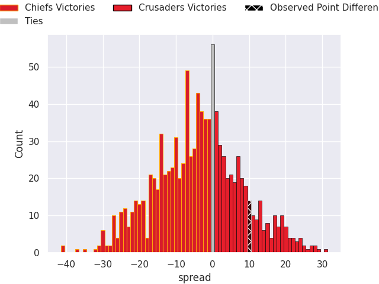

# Chiefs V Crusaders on 2026/02/28, 33.0 to 43.0

# Club Level Predictions

Now that the game has been played, lets see how the club predictions did. I predicted Chiefs to win by 3.66, and Crusaders won by 10.0. That's an absolute error of 13.7 for the margin of victory, while my average absolute error has been 13.2 over the past six months. This prediction was more accurate than 36.4% of my recent predictions.

For the Over/Under model, I predicted a total of 47.5 and we have an actual total of 76.0. That's an absolute error of 28.5 compared to a six month average of 13.0. This prediction was more accurate than 8.9% of my recent predictions.
## Projected Performances - Club Model

## Projected Spreads - Club Model

## Projected Results - Club Model

