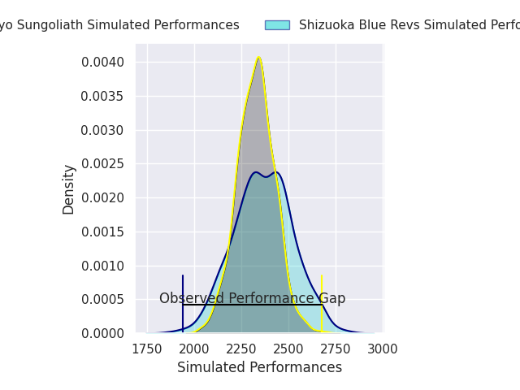
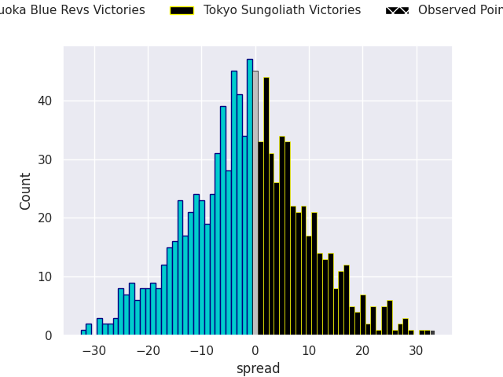

# Shizuoka Blue Revs V Tokyo Sungoliath on 2026/02/28, 24.0 to 57.0

# Club Level Predictions

Now that the game has been played, lets see how the club predictions did. I predicted Shizuoka Blue Revs to win by 1.42, and Tokyo Sungoliath won by 33.0. That's an absolute error of 34.4 for the margin of victory, while my average absolute error has been 13.2 over the past six months. This prediction was more accurate than 5.8% of my recent predictions.

For the Over/Under model, I predicted a total of 50.5 and we have an actual total of 81.0. That's an absolute error of 30.5 compared to a six month average of 12.9. This prediction was more accurate than 6.5% of my recent predictions.
## Projected Performances - Club Model

## Projected Spreads - Club Model

## Projected Results - Club Model

