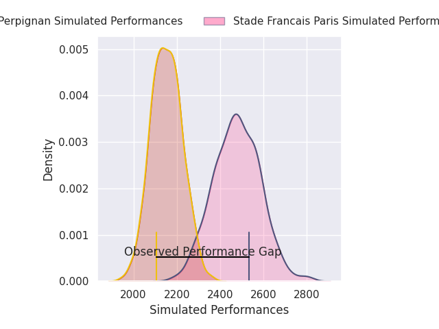
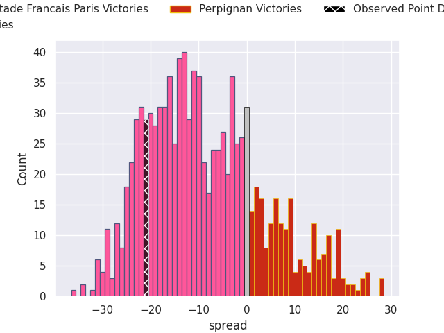
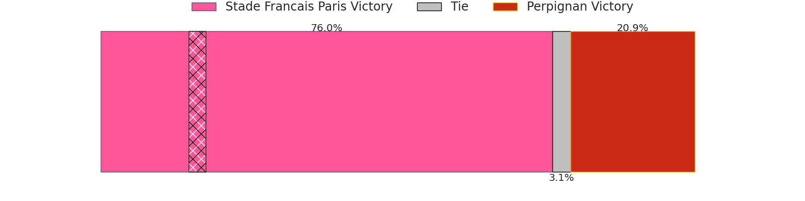

# Stade Francais Paris V Perpignan on 2026/02/28, 42.0 to 21.0

# Club Level Predictions

Now that the game has been played, lets see how the club predictions did. I predicted Stade Francais Paris to win by 8.66, and Stade Francais Paris won by 21.0. That's an absolute error of 12.3 for the margin of victory, while my average absolute error has been 13.3 over the past six months. This prediction was more accurate than 40.2% of my recent predictions.

For the Over/Under model, I predicted a total of 46.5 and we have an actual total of 63.0. That's an absolute error of 16.5 compared to a six month average of 12.9. This prediction was more accurate than 29.7% of my recent predictions.
## Projected Performances - Club Model

## Projected Spreads - Club Model

## Projected Results - Club Model

