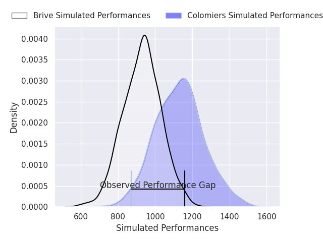
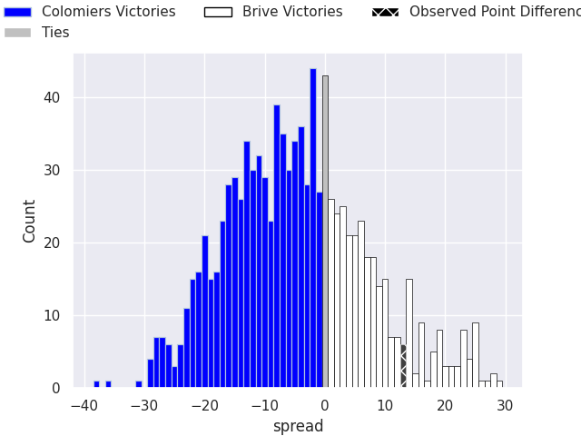
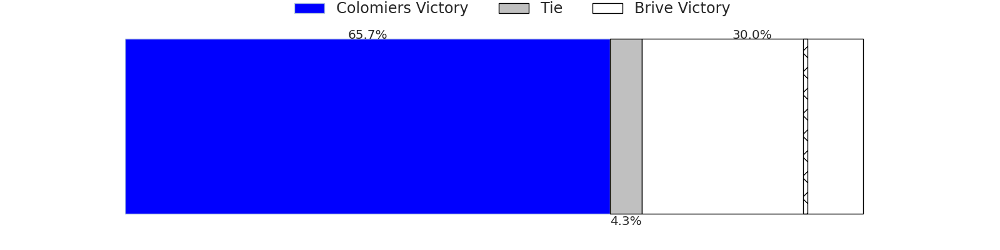

# Colomiers V Brive on 2026/03/05, 10.0 to 23.0

# Club Level Predictions

Now that the game has been played, lets see how the club predictions did. I predicted Colomiers to win by 6.53, and Brive won by 13.0. That's an absolute error of 19.5 for the margin of victory, while my average absolute error has been 13.2 over the past six months. This prediction was more accurate than 23.0% of my recent predictions.

For the Over/Under model, I predicted a total of 45.5 and we have an actual total of 33.0. That's an absolute error of 12.5 compared to a six month average of 12.9. This prediction was more accurate than 42.4% of my recent predictions.
## Projected Performances - Club Model

## Projected Spreads - Club Model

## Projected Results - Club Model

# Player Level Predictions

With the player model, I predicted Colomiers to win by 4.7,  and Brive won by 13.0. That's an absolute error of 17.7 for the margin of victory, while the average error as been 13.2 for the past six months. So this prediction was more accurate than 22.2% of my recent predictions.
## Projected Performances - Player Model

## Projected Spreads - Player Model

## Projected Results - Player Model

