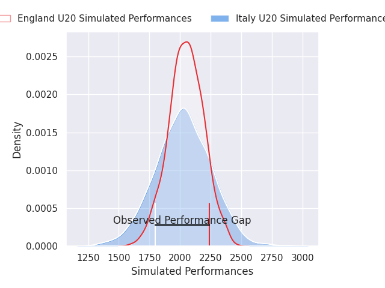
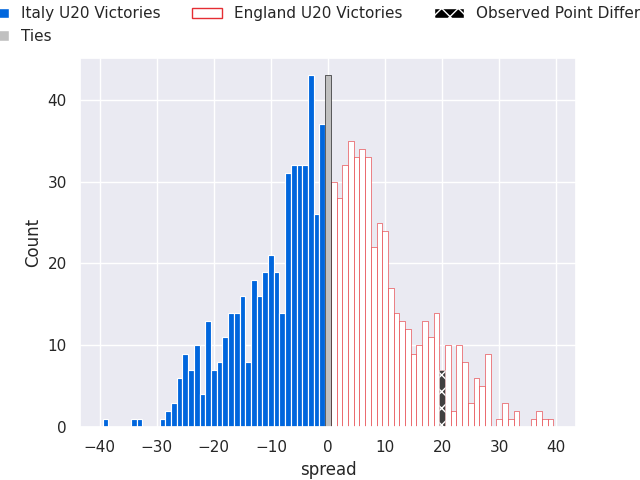

# Italy U20 V England U20 on 2026/03/06, 17.0 to 37.0

# Club Level Predictions

Now that the game has been played, lets see how the club predictions did. I predicted England U20 to win by 0.32, and England U20 won by 20.0. That's an absolute error of 19.7 for the margin of victory, while my average absolute error has been 13.2 over the past six months. This prediction was more accurate than 22.7% of my recent predictions.

For the Over/Under model, I predicted a total of 51.5 and we have an actual total of 54.0. That's an absolute error of 2.5 compared to a six month average of 13.0. This prediction was more accurate than 88.4% of my recent predictions.
## Projected Performances - Club Model

## Projected Spreads - Club Model

## Projected Results - Club Model

