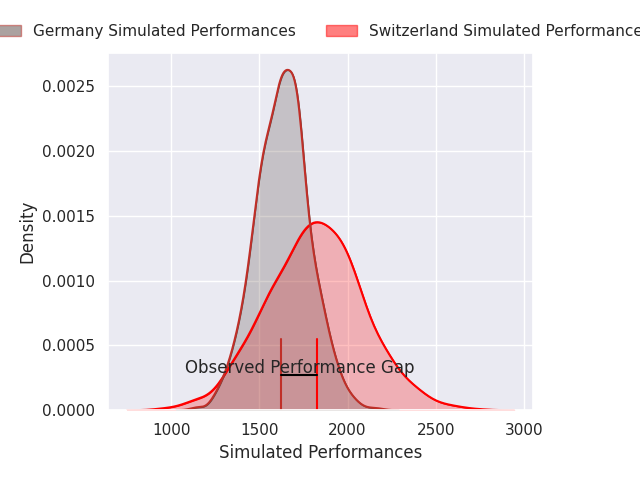
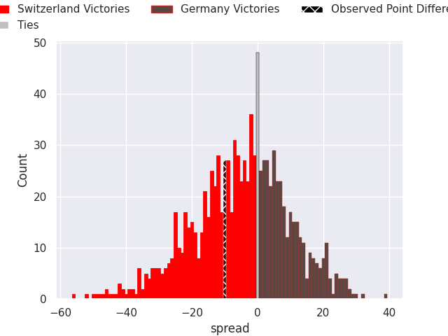

# Switzerland V Germany on 2026/03/07, 35.0 to 25.0

# Club Level Predictions

Now that the game has been played, lets see how the club predictions did. I predicted Switzerland to win by 4.96, and Switzerland won by 10.0. That's an absolute error of 5.0 for the margin of victory, while my average absolute error has been 13.2 over the past six months. This prediction was more accurate than 74.2% of my recent predictions.

For the Over/Under model, I predicted a total of 62.5 and we have an actual total of 60.0. That's an absolute error of 2.5 compared to a six month average of 13.0. This prediction was more accurate than 88.4% of my recent predictions.
## Projected Performances - Club Model

## Projected Spreads - Club Model

## Projected Results - Club Model

