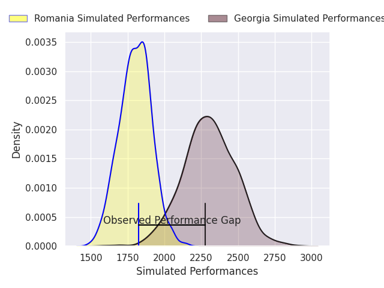
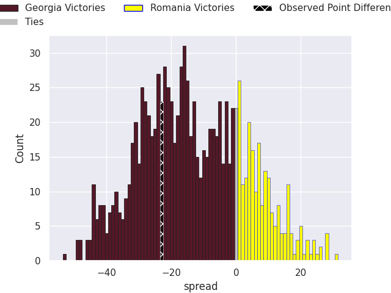

# Georgia V Romania on 2026/03/08, 53.0 to 30.0

# Club Level Predictions

Now that the game has been played, lets see how the club predictions did. I predicted Georgia to win by 13.5, and Georgia won by 23.0. That's an absolute error of 9.5 for the margin of victory, while my average absolute error has been 13.2 over the past six months. This prediction was more accurate than 51.1% of my recent predictions.

For the Over/Under model, I predicted a total of 48.5 and we have an actual total of 83.0. That's an absolute error of 34.5 compared to a six month average of 13.0. This prediction was more accurate than 2.9% of my recent predictions.
## Projected Performances - Club Model

## Projected Spreads - Club Model

## Projected Results - Club Model

